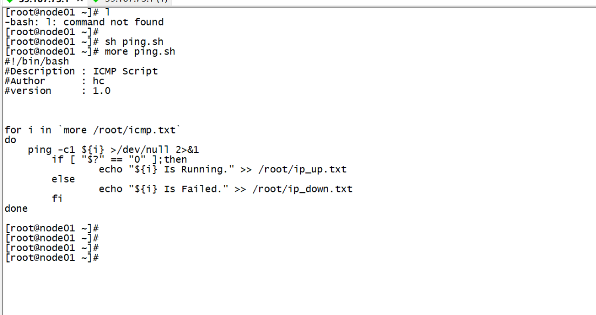

## testtesttest





---

## kali中用户权限

```text
sudo su		【切换到root用户，也就是切换到超级权限用户，拥有最高权限】
adduser derry	【创建derry新用户，紧接着填写 密码】
passwd derry	【修改此derry用户的密码】
usermod -aG sudo	【derry把derry用户加入到sudo组】
groups derry 	【查看加入到了那些组】
su derry 	【切换到新用户derry】
```


