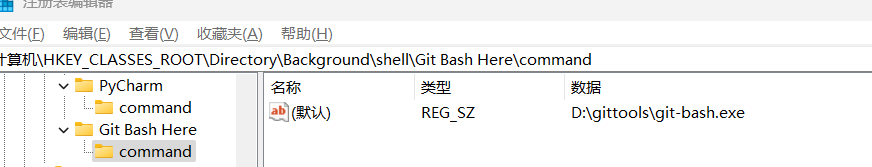
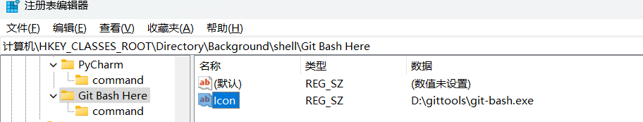

## 鼠标右键菜单不显示Git Bash Here解决方法

### 解决：

1、win+r键，打开命令窗口,输入regedit **打开注册表**

2、在注册表中按照路径打开**\HKEY_CLASSES_ROOT\Directory\Background\shell\ **

3、在shell上**右键新建项，**取名**Git Bash Here，**再点击**Git Bash Here**右键新建项取名**command**

4、在command中标注'**默认'**的地方右键修改，值为本地 **git **的安装目录**（你的git安装目录加上git-bash.exe）**

5、添加图标。点击**文件夹Git Bash Here**。在command中右键新建字符串值，取名为**Icon**，右键修改为：你的git-bash目录（例如：**D:\gittools\git-bash.exe**）

