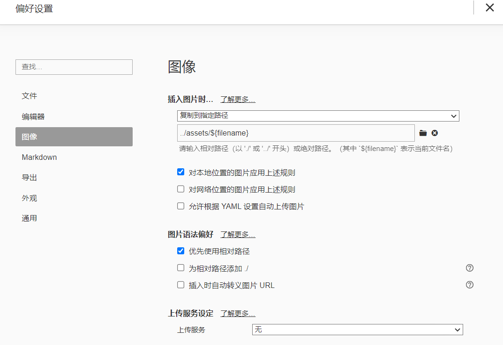
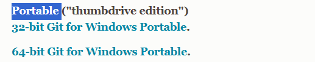
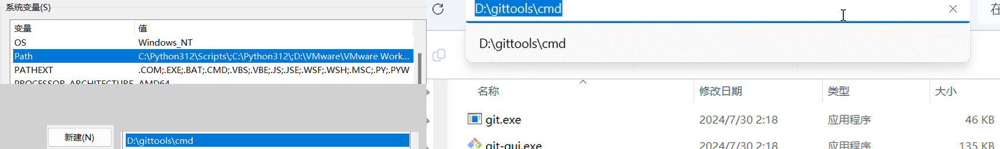
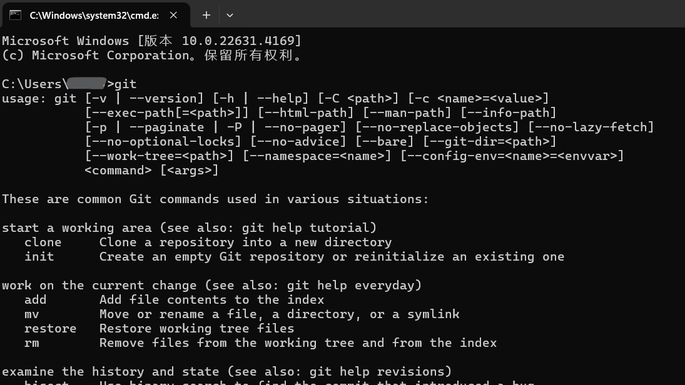
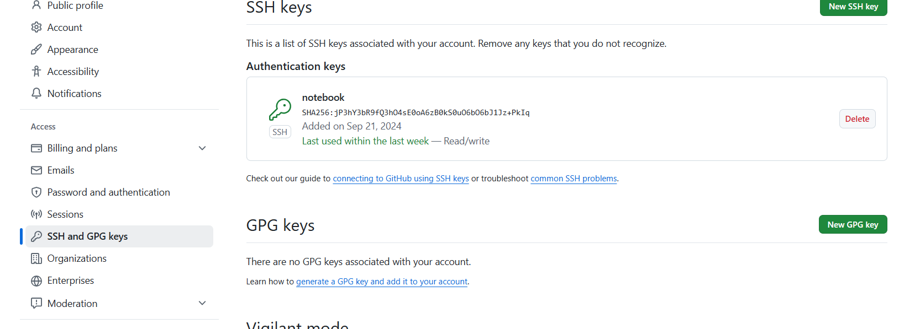
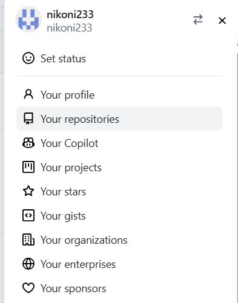
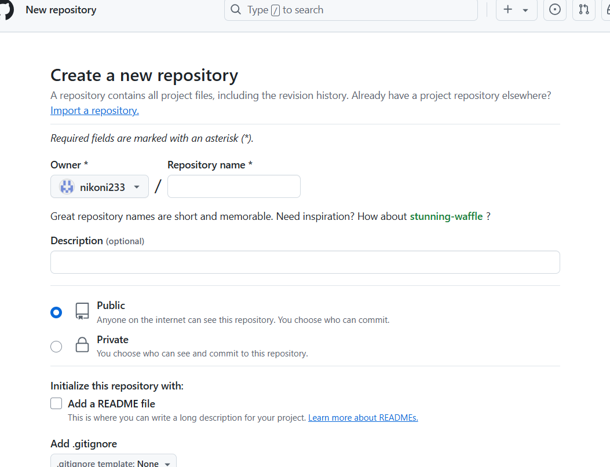

## Typora+github-云笔记

参考链接：https://www.bilibili.com/video/BV14f4y1Q7eu


---

### 1. Typora介绍

Typora 是一款**支持实时预览的 Markdown 文本编辑器**。它有 OS X、Windows、Linux 三个平台的版本，并且由于仍在测试中，是**完全免费**的。下载地址：https://www.typora.io/

#### 关于 Markdown

Markdown 是用来编写结构化文档的一种纯文本格式，它使我们在双手不离开键盘的情况下，可以对文本进行一定程度的格式排版。

由于目前还没有一个权威机构对 Markdown 的语法进行规范，各应用厂商制作时遵循的 Markdown 语法也是不尽相同的。其中比较受到认可的是 [GFM 标准](https://github.github.com/gfm/)，它是由著名代码托管网站 [GitHub](https://github.com/) 所制定的。Typora 主要使用的也是 GFM 标准。同时，你还可以在 `文件 - 偏好设置 - Markdown 语法偏好 - 严格模式` 中将标准设置为「更严格地遵循 GFM 标准」。具体内容你可以在官方的 [这篇文档](http://support.typora.io/Strict-Mode/) 中查看。


---

### 2.Typora安装和设置

下载地址：https://www.typora.io/#windows

#### 图像保存路径设置

图像设置，在这里设置插入图片的保存规则，选相对路径，在你的笔记目录下建一个文件夹专门存放图片，然后把放图片那个目录设置隐藏，这样在下面菜单中就不会显示了，都是我们的笔记看着很清爽。

`‘图像设置这样做的目的是：为了让我们这托管的网站查看我们的笔记的时候也能看到笔记中的图片`

````text
复制到指定路径
../assets/${filename}
````





---

### 3. Git安装 用github托管我们的笔记

#### 3.1 git安装和设置环境变量

Git安装：https://git-scm.com/downloads

如果我们单纯用来做笔记本，我们就下载便携版本的git,下载完解压就能用
把git解压目录下的cmd文件夹路径添加到系统变量中

便携版本git：[Portable]


添加系统环境变量：cmd文件夹路径



测试：cmd命令输入git测试运行




#### 3.2 生成ssh公钥,使用ssh公钥不需要每次向github提交都输入密码

**打开git bash** 输入下列代码

1. **设置全局的用户名和邮箱**，每次提交的时候的信息

```shell
git config --global user.email "123456789@qq.com"
git config --global user.name "nikoni"
```

2. **生成ssh登录公钥和私钥**，默认路径是`C:\Users\用户名\.ssh\`

```shell
ssh-keygen -t rsa -C "123456789@qq.com"
```

默认路径是`C:\Users\用户名\.ssh\`下有两个文件：

> id_rsa（私钥）和 id_rsa.pub（公钥）
>
> 私钥是你本地主机的唯一凭证，你要保管好，不能发给任何人。
> 公钥是你配置在你的github账号上，让github知道是你这个主机要跟他连接，公钥是公开的，无需保密。

如果你想自定义这个存储路径的话，例如这样：
```shell
ssh-keygen -t rsa -f  E:\test   -C "test key"

ssh-keygen -t rsa -f  ~/.ssh/test   -C "test key"
```

> 代码参数含义：
> `-t` 指定密钥类型，默认是 rsa ，可以省略。
> `-C` 设置注释文字，比如邮箱。
> `-f` 指定密钥文件存储文件名。

- 执行命令后需要进行3次或4次确认：
	1. 确认秘钥的保存路径（如果不需要改路径则直接回车）；
	2. 如果上一步置顶的保存路径下已经有秘钥文件，则需要确认是否覆盖（如果之前的秘钥不再需要则直接回车覆盖，如需要则手动拷贝到其他目录后再覆盖）；
	3.  创建密码（如果不需要密码则直接回车）；（该密码是你push文件的时候要输入的密码，而不是github管理者的密码）
		当然，你也可以不输入密码，直接按回车。那么push的时候就不需要输入密码，直接提交到github上了
		这里我们选择按回车不输出密码
	4. 确认密码；

- 执行完这个代码后在我们的用户目录下会生成一个.ssh的隐藏文件夹，文件夹里面有两个文件id_rsa和id_rsa.pub，前者是私钥，后者是公钥，复制id_rsa.pub的内容添加到github的ssh公钥处

- 目录.ssh下的文件说明：
	id_rsa ：存放私钥的文件
	id_rsa.pub ：存放公钥的文件
	known_hsots ：可以保存多个公钥文件，每个访问过计算机的公钥(public key)都记录在~/.ssh/known_hosts文件中
	authorized_keys ：A机器生成的公钥-->放B的机器.ssh下authorized_keys文件里，A就能免密访问B，但是B不能访问A。如果需要两台电脑互相访问均免密码。则需要重复上面的步骤（机器的配置刚好相反）。

- ssh在建立连接的时候不指定-i参数会默认寻找 ~/.ssh/id_rsa
	若是省略 -i 参数，则 ssh-copy-id 会将默认的密钥 ~/.ssh/id_rsa 对应的公钥交付给远程主机。


#### 3.3 将ssh公钥添加到github的ssh keys中

1. **进入github界面，登录你的github账号。**

2. **点击你的github头像，下拉菜单，选择`Settings`设置。**

3. **然后选择左边的`SSH and GPG keys`。**

4. **然后在`SSH keys`中，点击`New SSH key`，配置你的SSH公钥。**





#### 3.4  在github中新建仓库，获取仓库的ssh链接

1. **点击你的github头像，下拉菜单，选择`Your repositores`你的仓库。**

2. **点击右上角的`NEW`新建仓库。**

3. **配置你的仓库一些初始信息。**






---

### 4. 注意事项

#### 4.1 笔记文件名不要包含空格，如果有空格那么上传到github中预览的时候将无法看到图片

#### 4.2 笔记文件名不要太长，太长也会出现上述问题

### 5.额外说明-把图片和笔记分开存放

上面的笔记搭建是图片和笔记都存放在本地，然后一起推送到远程仓库，但这样做有个问题，当我们写了比较多的笔记，这时候图片就会占据大量的空间，github一个仓库1G（超过1G会收到邮件），gitee一个仓库500M（gitee免费用户总容量5G）


#### github个人用户仓库容量说明

https://docs.github.com/en/github/managing-large-files/what-is-my-disk-quota


GitHub每个Repo的大小限制为100GB，单个文件大小限制为100MB，我们用作图床管够


所以这里我们可以把图片和笔记分开存放，图片存放在多个图片仓库中，笔记就用单独的笔记仓库，这样1G的笔记仓库能够容纳非常多的文本了基本用不完

但上述方式就需要在写笔记的时候先进行图片的上传，使用picgo工具配合typora把图片上传到github仓库


---

### 6.自动上传脚本

**脚本文件：**[点我，快速跳转](..\Script脚本集(bat,shell)\typora+github云笔记，自动上传脚本)

**项目库链接：**[点我，快速跳转](https://github.com/nikoni233/scripts/tree/main/AutoUpdate_TyporaWithGithub)

**食用方法：**

1. 把下面的脚本代码保存复制到一个文件中，替换其中的仓库地址（换成你自己的）`git@github.com:你的github用户名/你的仓库名.git`，命名为`AutoUpdate.bat`，然后放到你的笔记文件的根目录下。

2. 然后再创建一个文件，名为`.gitignore`，这个名字不能随便改，是Git的配置文件。
	```
	AutoUpdate.bat
	Auto*.bat
	```

3. 双击运行`AutoUpdate.bat`。

**脚本代码：**

```bat
@echo off
chcp 65001 >nul

REM :: AutoUpdate.git
REM :: 在运行之前，要先在你的本地生成一对ssh的公钥和秘钥，把公钥配置在你的github账户上。
REM :: 自动上传脚本，双击bat文件运行，自动上传至你所连接的github库上。
REM :: 脚本运行前两行的报错是一些什么注释奇怪标识符的问题，不影响正常使用，想要不显示报错把这几行注释删掉就好了。（我也不知道为什么）

echo AutoUpdate to github
echo HHHHHHHHHHHHHHHHHHHHHHH

if not exist ".git" (
    REM 第一次运行脚本，如果没有目录仓库初始化的话，会自动初始化，并进行第一次上传github。
    echo Current directory is not initialized, initializing...
    echo "# notebook" >> README.md
    git init
    REM 你github远程仓库的ssh链接地址，把这个地址替换成你自己的仓库地址：git@github.com:你的github用户名/你的仓库名.git
    REM 上传至你github远程仓库时报错，有可能是你ssh公钥没有配置。（小提示）
	git remote add origin git@github.com:nikoni233/notebook.git
    git add .
    git commit -m "This is a initial commit"
    git branch -M main
    git push -u origin main
    REM 初始化操作写入日志，上传日志
    echo Initialization log and first commit.[%date% %time%] >> Update.log
	git add Update.log
	git commit -m "auto update log"
	git push
)else (
	git status --porcelain | findstr . >nul
	if errorlevel 1 (
	REM 没有文件更新，不上传
	echo No files changed.
	)else (
		REM 有文件更新，进行上传
		echo File changed.Commit changed files.
		git add .
		git commit -m "auto update files"
		git push
		REM 更新写入日志，上传日志
    	echo Auto update files.[%date% %time%] >> Update.log
		git add Update.log
		git commit -m "auto update log"
		git push

	)

)


timeout /t 30
```

