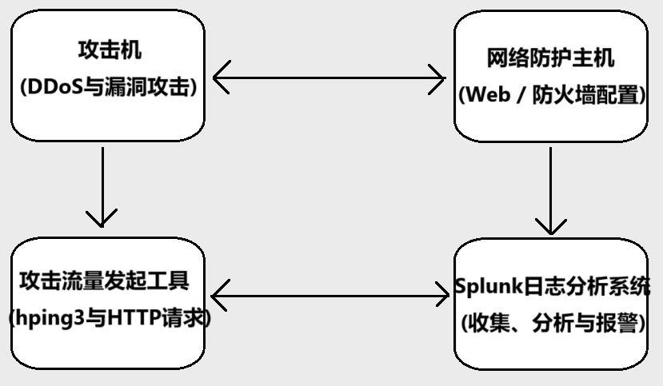
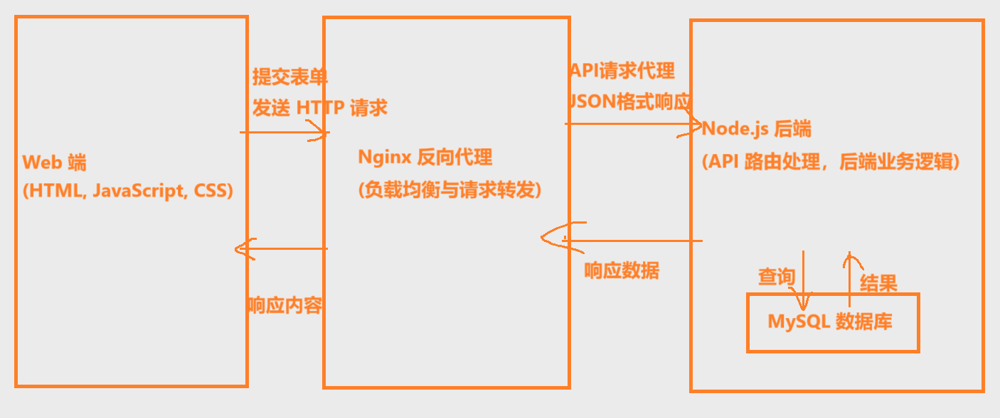

## 【基础环境】系统初始化，Rocky Linux系统

系统ISO： `Rocky-8.10-x86_64-minimal.iso`

### 1. 系统通用初始配置

**网卡配置、修改主机名、关闭firewalld、清空iptables、关闭selinux规则、优化系统配置文件`/etc/sysctl.conf`和`/etc/security/limits.conf`、安装基础组件包。**

```bash
sed -i "s/ONBOOT=no/ONBOOT=yes/g" /etc/sysconfig/network-scripts/ifcfg-ens160
systemctl restart NetworkManager
#NIC_NAME=`ls -l /sys/class/net/ | grep -i 'pci'| awk -F"/" '{print $NF}'`
#sed -i "s/ONBOOT=no/ONBOOT=yes/g" /etc/sysconfig/network-scripts/ifcfg-${NIC_NAME}
```

```bash
hostnamectl set-hostname [主机名]
```

```bash
systemctl disable firewalld && systemctl stop firewalld
iptables -F && iptables -Z && iptables -X
##############
GET_STATUS=`more /etc/selinux/config | grep -i '^SELINUX=' | awk -F"=" '{print $2}'`
if [ "${GET_STATUS}" == "enforcing" ];then
	sed -i "s/SELINUX=enforcing/SELINUX=disabled/g" /etc/selinux/config
elif [ "${GET_STATUS}" == "permissive" ];then
	sed -i "s/SELINUX=permissive/SELINUX=disabled/g" /etc/selinux/config
fi
```

`/etc/sysctl.conf`添加内容：

然后输入 `/sbin/sysctl -p` 。查看修改。

```conf
fs.file-max = 655360
vm.max_map_count = 262144
vm.swappiness = 10
kernel.sysrq = 0
net.ipv4.tcp_syncookies = 1
net.ipv4.tcp_syn_retries = 1
net.ipv4.tcp_tw_reuse = 1
net.ipv4.tcp_fin_timeout = 1
net.ipv4.tcp_keepalive_time = 1200
net.ipv4.ip_local_port_range = 1024 65535
net.ipv4.tcp_max_syn_backlog = 16384
net.ipv4.tcp_max_tw_buckets = 36000
net.ipv4.route.gc_timeout = 100
net.ipv4.tcp_syn_retries = 1
net.ipv4.tcp_synack_retries = 1
net.core.somaxconn = 16384
net.core.netdev_max_backlog = 16384
net.ipv4.tcp_max_orphans = 16384
net.ipv4.conf.all.send_redirects = 0
net.ipv4.conf.default.send_redirects = 0
net.ipv4.conf.all.accept_source_route = 0
net.ipv4.conf.default.accept_source_route = 0
net.ipv4.conf.all.accept_redirects = 0
net.ipv4.conf.default.accept_redirects = 0
net.ipv4.conf.all.secure_redirects = 0
net.ipv4.conf.default.secure_redirects = 0
net.ipv4.icmp_echo_ignore_broadcasts = 1
net.ipv4.icmp_ignore_bogus_error_responses = 1
net.ipv4.conf.all.rp_filter = 1
net.ipv4.conf.default.rp_filter = 1
net.ipv4.tcp_syncookies = 1
kernel.dmesg_restrict = 1
net.ipv6.conf.all.accept_redirects = 0
net.ipv6.conf.default.accept_redirects = 0
```

`/etc/security/limits.conf`添加内容：

然后输入 `ulimit -Sn` 。 查看效果：1024 -> 65536 。

```conf
* soft nproc 20480
* hard nproc 20480
* soft nofile 65536
* hard nofile 65536
* soft memlock unlimited
* hard memlock unlimited
```

```bash
yum install -y tar zip wget net-tools gcc nmap vim python3 tree epel-release
```

### 2. 针对splunk和nginx+nodejs+mysql 配置

相关组件的安装启动与配置、测试数据库导入

```bash
#dnf install -y epel-release
dnf install -y syslog-ng nginx mysql-server nodejs

#nginx+nodejs+mysql和syslog-ng，启动+开机自启
systemctl start nginx mysqld syslog-ng && systemctl enable nginx mysqld syslog-ng
```

```sql
#SELECT user, host FROM mysql.user WHERE user='root';
ALTER USER 'root'@'localhost' IDENTIFIED BY 'root123456';
UPDATE mysql.user SET Host = '%' WHERE User = 'root';
FLUSH PRIVILEGES;
```

```bash
mysql -u root -p < testdata_stu.sql 
```

`testdata_stu.sql`内容：

```sql
-- testdata_stu.sql
-- 创建数据库
CREATE DATABASE IF NOT EXISTS testdata_stu;
-- 使用该数据库
USE testdata_stu;
-- 创建 info_stu 表
CREATE TABLE IF NOT EXISTS info_stu (
    id INT AUTO_INCREMENT PRIMARY KEY,
    name VARCHAR(50),
    sex VARCHAR(10),
    age INT,
    tel VARCHAR(20)
);
-- 创建 acct_stu 表
CREATE TABLE IF NOT EXISTS acct_stu (
    id INT PRIMARY KEY,
    acct VARCHAR(50),
    passwd VARCHAR(50),
    money DECIMAL(10, 2)
);
-- 插入 info_stu 表基础数据
INSERT INTO info_stu (name, sex, age, tel) VALUES
('John Doe', 'Male', 20, '1234567890'),
('Jane Smith', 'Female', 22, '2345678901'),
('Alice Johnson', 'Female', 21, '3456789012'),
('Bob Williams', 'Male', 23, '4567890123');
-- 插入 acct_stu 表基础数据
INSERT INTO acct_stu (id, acct, passwd, money) VALUES
(1, 'johndoe@testdata.cat', 'password123', 1000.00),
(2, 'janesmith@testdata.cat', 'password456', 1500.50),
(3, 'alicejohnson@testdata.cat', 'password789', 2000.00),
(4, 'bobwilliams@testdata.cat', 'password000', 500.75);
```


## 【splunk学习】SYN flood、数据泄露

### 1.下载安装

官网：https://www.splunk.com/

注册 `sign up` ，使用海外邮箱（例如outlook），不然接受不到验证邮件，下载 `free splunk` 。

免费版，每天500MB索引。

[数据可视化工具Splunk Enterprise免费下载 | Splunk](

```bash
wget http://192.168.255.1:7979/splunk-9.4.0-6b4ebe426ca6-linux-amd64.tgz
#wget -O splunk-9.4.0-6b4ebe426ca6-linux-amd64.tgz "https://download.splunk.com/products/splunk/releases/9.4.0/linux/splunk-9.4.0-6b4ebe426ca6-linux-amd64.tgz"

tar -xvzf splunk-9.4.0-6b4ebe426ca6-linux-amd64.tgz
#tar -xzf splunk-9.4.0-6b4ebe426ca6-linux-amd64.tgz && echo "done!"
mv splunk /opt/splunk
ln -s /opt/splunk /usr/local/splunk

#初始化启动，并接受许可协议
/opt/splunk/bin/splunk start --accept-license
#账号：catroot   密码：Ccu2024@
#访问：http://<your-server-ip>:8000

#开机自启
/opt/splunk/bin/splunk enable boot-start
#禁用开机
#/opt/splunk/bin/splunk disable boot-start

#停止服务
#/opt/splunk/bin/splunk stop
```


### 2. 导入数据源

#### 导入的数据源（日志文件）是什么？

**以本次的两种攻击（DDoS - - SYN flood、数据泄露 - - 敏感文件非法访问），为例。**

- DDoS - - SYN flood >> `/var/log/messages`

	配置`iptables`来记录所有入站的TCP连接，并输出日志到`/var/log/messages`。

	```bash
	iptables -A INPUT -p tcp --syn --dport 8080 -j LOG --log-prefix "SYN Packet: " --log-level 4
	```

- 数据泄露 - - 敏感文件非法访问，利用 靶场Web应用的漏洞 - - 目录遍历漏洞 >> `/var/log/nginx/access.log` 

#### splunk导入数据源的操作方法：

##### 方法一：命令行添加

>**添加数据源的 默认配置文件：**
>** `/opt/splunk/etc/system/default/inputs.conf` **
>
>**添加数据源的 配置文件： **
>**`/opt/splunk/etc/system/local/inputs.conf`** 
>
>```conf
>[monitor:///var/log/nginx/access.log]
>disabled = false
>index = main
>sourcetype = nginx:access
>```

```bash
# 命令行添加数据源
/opt/splunk/bin/splunk add monitor /var/log/nginx/access.log
```

```bash
# 删除数据源命令
/opt/splunk/bin/splunk remove monitor /var/log/nginx/access.log
# 检查当前监控的文件
/opt/splunk/bin/splunk list monitor
# 重新启动Splunk服务
/opt/splunk/bin/splunk restart
```

##### 方法二：splunk web端添加

操作流程：

1.设置--添加数据；2.选择导入方式--本地监视；3.选择监控路径--文件和目录--路径浏览；4.设置来源类型--来源类型；5.输入设置--索引；完成添加。

### 3. 模拟攻击测试，生成日志内容。【使用靶场】

- **DDoS - - SYN flood。`kali` 中使用 `hping3` 工具。**

	```bash
	hping3 -S --flood -p 8080 192.168.255.130
	```

	查看 `/var/log/messages` 发现：

	```log
	Jan  3 22:24:55 catcat-02 kernel: SYN Packet: IN=ens160 OUT= MAC=00:0c:29:bd:0c:c8:00:0c:29:69:c2:82:08:00 SRC=192.168.255.129 DST=192.168.255.130 LEN=40 TOS=0x00 PREC=0x00 TTL=64 ID=4127 PROTO=TCP SPT=51541 DPT=8080 WINDOW=512 RES=0x00 SYN URGP=0 
	```

- **数据泄露 ，利用 靶场Web应用的漏洞 - - 目录遍历漏洞。**

	在漏洞靶场中的 目录遍历漏洞 部分，使用工具 `BurpSuite` 改包发送。
	（直接浏览器改url通常不行，所以就得用bp改了。）

	构造 `payload` ：

	```http
	/image?filename=../../../../../etc/passwd
	```

	查看 `/var/log/nginx/access.log` 发现：

	```log
	192.168.255.129 - - [03/Jan/2025:18:42:08 +0800] "GET /image?filename=../../../../../etc/passwd HTTP/1.1" 200 1040 "http://192.168.255.130:8080/" "Mozilla/5.0 (Windows NT 10.0; Win64; x64) AppleWebKit/537.36 (KHTML, like Gecko) Chrome/124.0.6367.118 Safari/537.36" "-"
	```

查看日志文件小技巧： `tail -f [日志文件.log]`  （炒鸡好用捏awa）

### 4. 设计异常检测策略规则，查看可视化

- **DDoS - - SYN flood**

	```splunk
	index=main  
	| stats count by SRC, DST, _time  
	| where count > 100  
	```

- **数据泄露 ，利用 靶场Web应用的漏洞 - - 目录遍历漏洞**

	```splunk
	index=nginx_log  
	| search uri_path="*../*"  
	| stats count by clientip, uri_path, _time
	```

	

### 5. 更多ing..

有机会的话，会加入更多攻击的检测策略，还有简单的基础防御策略。

- DDOS攻击：nginx、mysql、系统
	- nginx：HTTP flood
	- mysql：connection flood、慢查询
	- 系统：SYN flood、ACK flood、UDP flood、ICMP flood
- SSH暴力破解：
- 数据泄露：
- SQL注入：
- XSS注入：
- 端口扫描：nmap扫描、dirbuster扫描、监控端口80、443等
- 恶意软件感染：文件上传

/var/log/secure
/var/log/messages
/var/log/nginx/access.log
/var/log/nginx/error.log
/var/log/mysqld.log
/var/log/mysql/slow_query.log

|  |
| :----------------------------------------------------------: |
|                  图 更多攻击与日志文件关系                   |


|  |
| :----------------------------------------------------------: |
|           图 splunk监测日志平台与模拟攻击的流程图            |


## 【自建漏洞靶场】nginx+node.js+mysql

这次的靶场搭建采用的是，将nginx服务器反向代理到nodejs后端服务器，接入mysql数据库服务器。

该漏洞靶场具有：xss攻击、sql注入、目录遍历、文件上传、恶意代码注入。

|  |
| :----------------------------------------------------------: |
|                    图 nginx+nodejs+mysql                     |

### 1. 目录结构：

```java
.target_web/
├── public/ #前端代码
│   ├── index.html #在8080端口上开放
│   └── js/
│       ├── comments.js
│       ├── search.js
│       ├── sql.js
│       └── upload.js
├── src/	#后端代码
│   ├── app.js #在3000端口上开放
│   └── routes/
│       ├── commentsAPI.js
│       ├── fileUploadAPI.js
│       ├── imageAPI.js
│       ├── searchAPI.js
│       └── sqlAPI.js
├── image/ #图片目录，imageAPI引用
├── secretd/ #敏感文件目录。合法访问是访问不到的
├── uploads/ #文件上传目录，fileUploadAPI引用
├── comments.json #评论区的评论保存json文件，commentsAPI引用
└── package-lock.json
```

### 2 .nginx配置文件：

 nginx配置文件 `/etc/nginx/nginx.conf` ：

```conf
#/home/nginx/target_web
    server {
        listen 8080;
        server_name localhost;
        client_max_body_size 10M;
        location / {
            root /home/nginx/target_web/public;
            index index.html;
        }
        location /upload {
            proxy_pass http://localhost:3000/upload;
        }
        location /search {
            proxy_pass http://localhost:3000/search;
        }
        location /comments {
            proxy_pass http://localhost:3000/comments;
        }
        location /login {
            proxy_pass http://localhost:3000/login;
        }
        location /image {
            proxy_pass http://localhost:3000;
        }
    }
```

然后重启 `nginx` 服务，使修改的配置生效。

```bash
systemctl restart nginx
```

### 3. 给予项目目录权限：

```bash
chown -R nginx:root /home/nginx
chmod -R 770 /home/nginx
```

- **需要注意的是：指定目录的所有父级目录均要有nginx访问权限，所以不要放到/root目录下。**

### 4. 启动访问：

```bash
#cd /home/nginx/target_web/
#后端
node src/app.js
#前端
#启动nginx
#浏览器访问：http://<your-server-ip>:8080
```


## 【拓展知识】mysql篇 [my.cnf] 和 [各种log日志]

#### 关于my.cnf、my.cnf.d/

**在/etc/my.cnf中，存在一句： `!includedir /etc/my.cnf.d`** 

MySQL 会查找 `/etc/my.cnf.d/` 目录下的所有文件，并将这些文件中的配置内容加载到 MySQL 配置中。这种做法通常用于将 MySQL 配置文件分割成多个小文件，以便于管理和维护。比如，某些特定的设置（如日志、缓存等）可以放在不同的文件中，而主配置文件 `/etc/my.cnf` 仅包含目录包含指令。

##### **表明 MySQL 在加载配置文件时优先级顺序： `mysql --help | grep my.cnf` **

>1. /etc/my.cnf：系统级的主配置文件。
>2. /etc/mysql/my.cnf：在某些 Linux 发行版中，MySQL 配置文件可能位于此路径
>3. ~/.my.cnf：当前用户主目录下的配置文件（如果存在）。

```bash
[root@catcat-02 ~]# mysql --help | grep my.cnf
                      order of preference, my.cnf, $MYSQL_TCP_PORT,
/etc/my.cnf /etc/mysql/my.cnf ~/.my.cnf 
```

##### 查询 MySQL 配置中的 log_error 变量， `SHOW VARIABLES LIKE 'log_error'`

```mysql
mysql> SHOW VARIABLES LIKE 'log_error';
+---------------+---------------------------+
| Variable_name | Value                     |
+---------------+---------------------------+
| log_error     | /var/log/mysql/mysqld.log |
+---------------+---------------------------+
1 row in set (0.01 sec)
```


#### 关于 general.log 和 mysqld.log、slow_query.log

>默认位置目录： `/var/log/mysql/` 

|          | general.log                                                  | mysqld.log                                                   | slow_query.log                                               |
| -------- | ------------------------------------------------------------ | ------------------------------------------------------------ | ------------------------------------------------------------ |
| **功能** | 记录所有对MySQL服务器的客户端连接、执行的SQL查询、以及每个查询的执行时间等详细信息。它是MySQL的通用日志文件。 | 记录MySQL服务器的启动、关闭、错误、警告以及其他重要的系统事件。它通常用于诊断MySQL服务器的状态和运行问题。 | 记录所有执行时间超过指定阈值的 SQL 查询。通过分析此日志，帮助识别性能瓶颈并优化查询。 |
| **内容** | 用户连接和断开。<br/>执行的SQL语句（包括查询、插入、更新等）。 | 启动、停止过程。<br/>错误信息，如数据库崩溃、配置错误等。    | 执行时间超过设定阈值的 SQL 查询语句。<br/>包括查询的执行时间、扫描的行数、查询时间、锁定时间等详细信息。 |

##### 启动（在 `my.cnf` 中添加）：

- **general.log**

	```cnf
	[mysqld]
	general_log = 1
	general_log_file = /var/log/mysql/general.log
	
	# 解读：启用、日志路径
	```

- **mysqld.log**

	```cnf
	[mysqld]
	log_error = /var/log/mysql/mysqld.log
	
	# 解读：日志路径
	```

- **slow_query.log**

	```cnf
	[mysqld]
	slow_query_log = 1
	slow_query_log_file = /var/log/mysql/slow_query.log
	long_query_time = 2
	#log_queries_not_using_indexes = 1
	
	# 解读：启用、日志路径、设置阈值、记录没有使用索引的查询（即使未超过阈值）
	```

