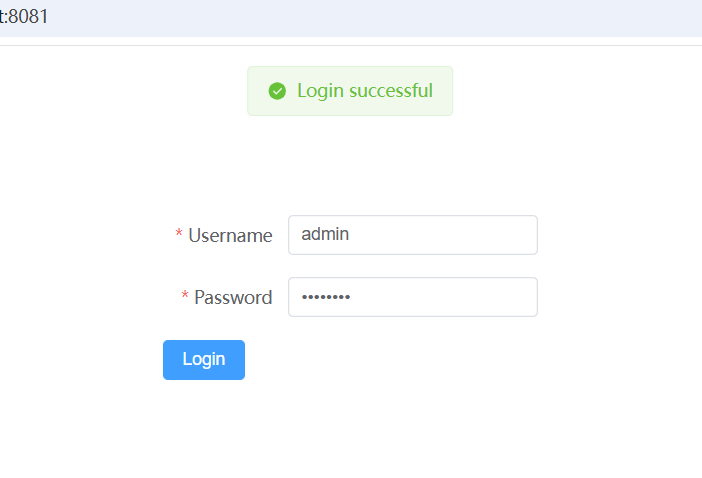
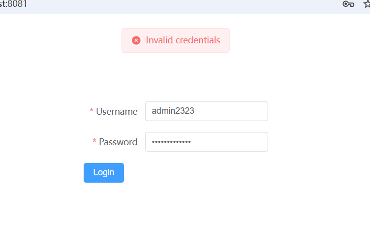

### 一个简单的登录界面（前后端分离）

#### 目录结构

```perl
ruoyi-example/
├── backend/              # 后端目录
│   ├── src/
│   │   ├── main/
│   │   │   ├── java/
│   │   │   │   ├── com/
│   │   │   │   │   └── ruoyi/
│   │   │   │   │       └── system/
│   │   │   │   │           ├── controller/
│   │   │   │   │           │   └── LoginController.java
│   │   │   │   │           ├── entity/
│   │   │   │   │           │   └── User.java
│   │   │   │   │           └── service/
│   │   │   │   ├── resources/
│   │   │   │   │   └── application.yml
│   └── pom.xml            # 后端 Maven 配置文件
├── frontend/             # 前端目录
│   ├── src/
│   │   ├── assets/
│   │   ├── components/
│   │   │   └── Login.vue  # 登录组件
│   │   ├── router/
│   │   │   └── index.js  # 路由组件
│   │   ├── views/
│   │   │   └── LoginPage.vue  # 登录页面
│   │   └── main.js        # 前端入口文件
└── README.md

```

#### 后端代码

`backend/pom.xml` — Maven 配置文件

```xml
<?xml version="1.0" encoding="UTF-8"?>
<project xmlns="http://maven.apache.org/POM/4.0.0"
         xmlns:xsi="http://www.w3.org/2001/XMLSchema-instance"
         xsi:schemaLocation="http://maven.apache.org/POM/4.0.0 http://maven.apache.org/xsd/maven-4.0.0.xsd">
    <modelVersion>4.0.0</modelVersion>

    <groupId>com.ruoyi</groupId>
    <artifactId>ruoyi-example</artifactId>
    <version>1.0-SNAPSHOT</version>
    <packaging>jar</packaging>

    <name>ruoyi-example</name>
    <url>http://maven.apache.org</url>

    <dependencies>
        <!-- Spring Boot Starter Web -->
        <dependency>
            <groupId>org.springframework.boot</groupId>
            <artifactId>spring-boot-starter-web</artifactId>
            <version>2.7.4</version> <!-- 添加版本号 -->
        </dependency>
        
        <!-- Spring Boot Starter Jackson (for JSON processing) -->
        <dependency>
            <groupId>org.springframework.boot</groupId>
            <artifactId>spring-boot-starter-json</artifactId>
            <version>2.7.4</version> <!-- 添加版本号 -->
        </dependency>

        <!-- Lombok for reducing boilerplate code -->
        <dependency>
            <groupId>org.projectlombok</groupId>
            <artifactId>lombok</artifactId>
            <version>1.18.24</version>
            <scope>provided</scope>
        </dependency>

        <!-- Spring Boot Starter Test -->
        <dependency>
            <groupId>org.springframework.boot</groupId>
            <artifactId>spring-boot-starter-test</artifactId>
            <version>2.7.4</version> <!-- 添加版本号 -->
            <scope>test</scope>
        </dependency>
    </dependencies>

    <build>
        <plugins>
            <plugin>
                <groupId>org.springframework.boot</groupId>
                <artifactId>spring-boot-maven-plugin</artifactId>
                <version>2.7.4</version> <!-- 添加版本号 -->
            </plugin>
        </plugins>
    </build>
</project>
```

`backend/src/main/java/com/ruoyi/system/entity/User.java` — 用户实体类

```java
package com.ruoyi.system.entity;

public class User {
    private String username;
    private String password;

    // getters and setters
    public String getUsername() {
        return username;
    }

    public void setUsername(String username) {
        this.username = username;
    }

    public String getPassword() {
        return password;
    }

    public void setPassword(String password) {
        this.password = password;
    }
}
```

`backend/src/main/java/com/ruoyi/system/controller/LoginController.java` — 登录控制器

```java
package com.ruoyi.system.controller;

import com.ruoyi.system.entity.User;
import org.springframework.web.bind.annotation.*;

@RestController
@RequestMapping("/api/auth")
@CrossOrigin(origins = "http://localhost:8081")  // 允许来自 http://localhost:8081 的跨域请求
public class LoginController {

    @PostMapping("/login")
    public String login(@RequestBody User user) {
        // 简单的验证逻辑：用户名和密码都为 admin
        if ("admin".equals(user.getUsername()) && "admin123".equals(user.getPassword())) {
            return "Login successful";
        }
        return "Invalid credentials";
    }
}
```

`backend/src/main/resources/application.yml` — Spring Boot 配置文件

```yml
server:
  port: 8080

spring:
  application:
    name: ruoyi-admin
```

`backend/src/main/java/com/ruoyi/system/RuoyiExampleApplication.java` — Spring Boot 启动类

```java
package com.ruoyi.system;

import org.springframework.boot.SpringApplication;
import org.springframework.boot.autoconfigure.SpringBootApplication;

@SpringBootApplication
public class RuoyiExampleApplication {

    public static void main(String[] args) {
        SpringApplication.run(RuoyiExampleApplication.class, args);
    }
}
```


#### 前端代码

`frontend/src/main.js` — Vue 入口文件

```js
import { createApp } from 'vue'
import App from './App.vue'
import ElementPlus from 'element-plus'
import 'element-plus/dist/index.css'
import router from './router' // 导入路由配置

const app = createApp(App)
app.use(ElementPlus)
app.use(router)  // 使用路由
app.mount('#app')
```

`frontend/src/components/LoginGo.vue` — 登录组件

```vue
<template>
  <div class="login-form">
    <el-form :model="form" ref="form" label-width="100px">
      <el-form-item label="Username" :rules="[{ required: true, message: 'Please input your username', trigger: 'blur' }]">
        <el-input v-model="form.username" placeholder="Username"></el-input>
      </el-form-item>
      
      <el-form-item label="Password" :rules="[{ required: true, message: 'Please input your password', trigger: 'blur' }]">
        <el-input type="password" v-model="form.password" placeholder="Password"></el-input>
      </el-form-item>

      <el-button type="primary" @click="submitForm">Login</el-button>
    </el-form>
  </div>
</template>

<script>
import { ElMessage } from 'element-plus';
import axios from 'axios';

export default {
  data() {
    return {
      form: {
        username: '',
        password: ''
      }
    };
  },
  methods: {
    submitForm() {
      axios.post('http://localhost:8080/api/auth/login', this.form)
        .then(response => {
          if (response.data === 'Login successful') {
            ElMessage.success('Login successful');
          } else {
            ElMessage.error('Invalid credentials');
          }
        });
    }
  }
};
</script>

<style scoped>
.login-form {
  width: 300px;
  margin: 100px auto;
}
</style>
```

`frontend/src/views/LoginPage.vue` — 登录页面

```vue
<template>
  <div class="login-page">
    <Login />
  </div>
</template>

<script>
import Login from '@/components/LoginGo.vue';

export default {
  components: {
    Login
  }
};
</script>

<style scoped>
.login-page {
  display: flex;
  justify-content: center;
  align-items: center;
  height: 100vh;
}
</style>
```

`frontend/src/App.vue` — 主组件

```vue
<template>
  <div id="app">
    <router-view /> <!-- Vue Router 将在这里渲染对应的页面 -->
  </div>
</template>

<script>
  export default {
    name: 'App'
  }
</script>
```

`frontend/src/router/index.js` — 路由组件

```js
import { createRouter, createWebHistory } from 'vue-router'
import LoginPage from '../views/LoginPage.vue'

const routes = [
    {
        path: '/',
        name: 'Login',
        component: LoginPage
    }
]

const router = createRouter({
    history: createWebHistory(process.env.BASE_URL),
    routes
})

export default router
```

### 食用方法

#### 后端启动

##### 1. 环境安装

(1) 电脑本机已安装 `Java` ，大于等于 `Java 8` 版本

(2) 电脑本机已安装 `Maven` 

​      “Maven的安装”：[Download Apache Maven – Maven](https://maven.apache.org/download.cgi)

​      “设置Maven环境变量”：Maven根目录/bin

​      “验证Maven”：`mvn -v`

##### 2. 运行 Spring Boot 后端

- 在 `backend` 目录下，使用 `Maven` 启动 `Spring Boot` 项目：

```bash
mvn spring-boot:run
```

该命令会启动 `Spring Boot` 项目，默认会在 `localhost:8080` 上监听请求。

#### 前端启动

##### 1. 环境安装

1. 确保你已经安装了 `Node.js` 和 `npm`。

2. 在 `webstorm` 上新建 `vue.js` 项目，初始化。

3. 安装 `Element Plus` 依赖
	```bash
	npm install element-plus
	```

4. 安装 `Vue Router` 依赖
	```bash
	npm install vue-router@4
	```

5. 安装 `axios` 依赖
	```bash
	npm install axios
	```

##### 2. 启动

- 在 `frontend` 目录下运行以下命令启动前端服务：

```bash
npm run serve
```

前端服务会启动在 `http://localhost:8081` 上。

### 运行结果



